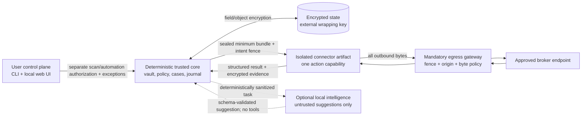

# MyCogni

MyCogni is a planned local-first, open-source system for recurring U.S. personal-data removal with auditable evidence and minimum necessary disclosure. It is for technically comfortable people who would rather self-host than give another SaaS a complete identity dossier.

> **Status — architecture and synthetic fixtures only.** This repository does not yet contain a runnable remover, accepted Docker image, or live broker connector. Its deterministic local simulator cannot contact a broker or deliver mail and must not be represented as a working privacy service. The roadmap begins with a read-only exposure preview and reaches narrowly controlled automatic submission only after security, legal, and connector gates pass.

MyCogni is not affiliated with or endorsed by Incogni, Surfshark, Nord Security, or any commercial removal provider. “MyCogni” is a working name pending a pre-release trademark and confusion review.

**[Explore the interactive project walkthrough](https://ninja91.github.io/MyCogni/)** to follow the evidence, intended user experience, safety behavior, architecture, adversarial review, and release path without reading the specification front to back.

## The product promise

The first supported product is intentionally narrow: one consenting U.S. adult, one self-hosted installation, a small disclosed set of high-impact people-search workflows, and proof that distinguishes activity from outcomes.

- **Local custody:** stored source data remains encrypted under user-controlled infrastructure; only the exact minimum values shown in an authorized plan may leave for a displayed destination.
- **Proof before claims:** `submitted`, `acknowledged`, `broker_asserted_removed`, `observed_absent_once`, `verified_removed`, `inconclusive`, and `resurfaced` are different states.
- **Minimum disclosure:** every released value, purpose, destination, and authorization is visible in a durable exportable ledger retained under the user's deletion and retention policy.
- **Hands-off where earned:** external actions start globally paused. After a separate, non-preselected, step-up per-capability ceremony, fresh trusted capabilities may act only inside that exact authorization; ambiguity, drift, identity challenges, and unknown outcomes stop.
- **No mystery queues:** every case exposes its state, reason, owner, last evidence, next action, and next date.
- **Sporadic operation:** local-lite can wake periodically on a laptop; a small single-tenant cloud profile is a separate post-v1 conformance target.
- **Governed extensions:** connectors expire, are promoted per capability, run outside the core, and have no vault or arbitrary-network access.

The project will not optimize headline broker counts, requests sent, GitHub stars, or a blended “completion” score. It will measure confirmed-match precision, verified outcomes, time and disclosure cost, resurfacing, manual burden, and connector freshness.

## What exists and what is planned

| Area | In this repository today | First stable v1 target | Later, only after evidence |
| --- | --- | --- | --- |
| Product | research, requirements, threat model, PMF experiments | single-adult U.S. proof-first workflow | household/guardian and non-U.S. policy |
| Runtime | architecture, executable skeleton, and synthetic-only simulator | signed amd64/arm64 OCI images | broader platform packaging |
| Discovery | synthetic registry example | small read-only exposure set with explainable matching | larger governed registry |
| Removal | lifecycle and authorization design | guided flows plus 2–5 trusted automatic capabilities | broader/custom automation |
| Evidence | normative semantics and diagrams | encrypted evidence, disclosure ledger, independent rechecks | additional attestation methods |
| Deployment | local-lite plus future cloud-small specifications | local-lite only | cloud-small after separate post-v1 conformance; no multi-tenant SaaS plan |
| Authentication custody | source-level native owner-file baseline; no production composition claim | reviewed native local-lite custody plus terminal/restore evidence | Keychain, Docker Desktop and cloud profiles only after separate conformance |
| Assistants | bounded integration design | no V1 integration surface | optional post-v1 metadata-only OpenClaw workflows |
| Local AI | advisory architecture and null adapter plan | no model dependency or bundled weights | opt-in shadow-tested assist, never decision authority |

The public support matrix is deliberately empty until connectors earn a maturity state; see [SUPPORTED_BROKERS.md](SUPPORTED_BROKERS.md).

## Why this shape

Independent studies and community discussions expose the same category failure: automation saves time, but opaque status labels and weak matching can manufacture confidence. A Consumer Reports/Tall Poppy evaluation found only 35% of observed profiles removed across evaluated services within four months in its small study, while manual opt-outs reached 70%. A 2025 PETS study reported 41.1% average user-confirmed record-link accuracy and 48.2% average removal effectiveness across the services it measured. Those figures are not forecasts for MyCogni; they are design warnings.

The referenced Reddit discussion values fast setup, recurring automation, aliases, custom requests, and visible progress. It also contains reports of vague evidence, unknown recheck cadence, stalled custom cases, pricing frustration, and uncertainty about promotional content. MyCogni treats anonymous comments as product hypotheses, not prevalence data. The [research synthesis](docs/01-research-synthesis.md) grades the evidence and links every source.

## Architecture at a glance

The command path is deterministic. Connector code is a separate digest-pinned artifact, not a Python plugin imported into the core. A durable submission journal separates immutable external intent from attempts and treats post-dispatch uncertainty as `outcome_unknown`, never as permission to retry. A mandatory egress gateway enforces the action fence before the first outbound byte.

The optional intelligence seam returns only an `UntrustedSuggestion`. It has no vault, database, network, connector, authorization, status, or submission capability. The default adapter is a no-op; no model or model weight is bundled. See [system architecture](docs/03-system-architecture.md), [security model](docs/05-security-privacy-threat-model.md), and the [diagram index](docs/diagrams/README.md).

## Non-negotiable safety rules

1. No request for another person without separately stored authority.
2. No automatic action for a name-only or ambiguous match.
3. No blanket broadcast of a complete identity profile.
4. No external send after a stale lease, revoked authorization epoch, connector quarantine, or active kill switch.
5. No automatic retry after dispatch begins unless reconciliation proves no send occurred.
6. No `verified_removed` state without policy-defined, post-submission corroboration; blocks and challenges are inconclusive.
7. No connector access to the core image, database, vault, key catalog, Docker socket, host network, or arbitrary egress.
8. No CAPTCHA/MFA bypass, rate-limit evasion, hidden browser action, or automatic response to changed terms.
9. No raw PII in logs, metrics, notifications, support bundles, issues, fixtures, or AI prompts.
10. No AI output can decide identity, legal basis, authorization, disclosure, destination, deadline, connector trust, verification, or execution.

## Release path

The delivery plan is milestone- and evidence-gated rather than a promise of dates:

- **Weeks 0–4 — Executable foundation:** locked project, synthetic simulator, network-deny CI, secure skeleton, and P0 spikes.
- **Weeks 4–9 — Secure local kernel:** authentication, encrypted identity, durable jobs/evidence, backup/restore proof, and a generic fail-closed outbound-action boundary.
- **Weeks 9–14 — Preview alpha:** separately authorized read-only exposure preview, explainable matching, evidence/case UI, and zero removal submissions.
- **Weeks 14–19 — Guided beta:** exact request plans/values, disclosure ledger, guided/manual drafts, proof vocabulary, digest, and pre-submit offboarding.
- **Weeks 19–26 — Controlled automation:** restore-safe journal, typed transport gateway, signed revocation/update metadata, human review, and 2–5 trusted automatic capabilities.
- **Weeks 26–32 — Release candidate:** corroborated verification, resurfacing, signed artifacts/SBOM/provenance, restore drills, accessibility, resilience, and external review.
- **Weeks 32–40 or later — Stable evidence gate:** the automatic cohort must mature for at least twelve weeks and day 90; only then can the project earn or fail stable V1. Cloud-small and optional intelligence remain post-v1.

Stable v1 is not reached by elapsed time. It requires zero unresolved P0 findings, no unresolved P1 on an enabled capability, qualified legal/security reviews, accessibility and restore drills, and at least twelve weeks plus a mature day-90 denominator for the automatic cohort. The issue-ready control pack is in [docs/v1](docs/v1/README.md); release-level context remains in [ROADMAP.md](ROADMAP.md) and [docs/10-execution-plan.md](docs/10-execution-plan.md).

## Documentation map

| Document | Purpose |
| --- | --- |
| [Product brief](docs/00-product-brief.md) | scope, principles, and success measures |
| [Research synthesis](docs/01-research-synthesis.md) | graded evidence from studies, official guidance, products, and communities |
| [Requirements](docs/02-requirements.md) | stable functional and quality requirement IDs |
| [System architecture](docs/03-system-architecture.md) | modules, isolation, external-intent semantics, and integration boundaries |
| [Data model and lifecycle](docs/04-data-model-and-lifecycle.md) | records, evidence assurance, state machines, and retention |
| [Security and privacy](docs/05-security-privacy-threat-model.md) | threats, controls, key hierarchy, authentication, and release gates |
| [Connector SDK](docs/06-connector-sdk.md) | artifact contract, maturity, sandbox, egress, and tests |
| [Deployment](docs/07-deployment-architecture.md) | local-lite/cloud-small profiles and conformance boundaries |
| [Operations](docs/08-observability-and-operations.md) | PII-safe diagnostics, runbooks, restore, and incident handling |
| [Testing](docs/09-testing-and-quality.md) | synthetic, adversarial, security, and release gates |
| [Execution plan](docs/10-execution-plan.md) | workstreams, dependencies, and acceptance criteria |
| [Stable V1 control pack](docs/v1/README.md) | issue-ready implementation plan, work packages, orchestration, reviews, and completion evidence |
| [Adversarial review](docs/11-adversarial-review.md) | review method, P0 findings, and applied changes |
| [Maintainer decisions](docs/12-decisions-and-interview.md) | confirmed choices and remaining interview prompts |
| [Independent role reviews](docs/reviews/README.md) | ML, backend/infra, edge, product, and OSS critiques |
| [Principal-team synthesis](docs/14-principal-team-synthesis.md) | accepted decisions, owners, dissent, and traceability |
| [Product-market fit](docs/15-product-market-fit.md) | wedge, experiments, metrics, and stop/go gates |
| [Local intelligence](docs/16-local-intelligence-architecture.md) | optional post-v1 advisory design and evaluation contract |
| [Architecture diagrams](docs/diagrams/README.md) | context, components, trust, sequence, lifecycle, data, deployment, and authority |
| [ADRs](docs/adr/README.md) | decisions constraining security, external actions, deployment, and AI |

## Contributor path

Today, useful contributions are architecture critiques, synthetic broker-simulator cases, registry-schema improvements, legal-source corrections, threat cases, documentation, accessibility review, and test design. Live broker traffic and real personal data never belong in CI or issues.

Read [CONTRIBUTING.md](CONTRIBUTING.md), [GOVERNANCE.md](GOVERNANCE.md), [SUPPORT.md](SUPPORT.md), and [SECURITY.md](SECURITY.md). Connector proposals begin as facts or `observe` capability and cannot become trusted automatic submission through one unreviewed change. Contributions use DCO sign-off rather than a separate CLA during project bootstrap.

## Honest limitations

Removal cannot erase public records at their source, downstream copies, breach data, unlawful brokers, or future recollection. Some private databases cannot be independently checked. Browser workflows remain brittle. Self-hosting shifts key, backup, and operations risk to the user. Open-source maintainers cannot promise legal representation, emergency response, or service-level guarantees.

California DROP is an official path for eligible residents and a candidate for separately reviewed guidance. MyCogni will not represent it as implemented, automate around residency or identity verification, or claim access to the broker-side processing API.

## License and project identity

Source code and original documentation are licensed under Apache-2.0; see [LICENSE](LICENSE) and [NOTICE](NOTICE). Broker facts, model artifacts, fixtures derived from external material, and imported datasets require separate provenance and license review. No third-party directory or commercial product content may be copied merely because it is publicly visible.
