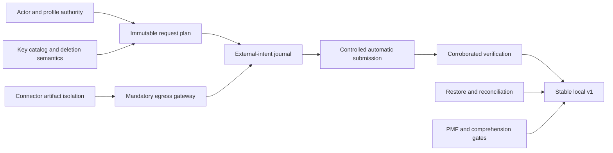

# MyCogni roadmap

The roadmap targets one experienced full-time engineer. A personal or part-time open-source effort should treat the week ranges as relative order and sizing. Release gates, not elapsed time, determine readiness.

## Product scope through stable v1

Stable v1 supports one consenting U.S. adult per installation, current and historical aliases, local-lite deployment, a small public support matrix, guided removal, narrowly trusted automatic connectors, independent rechecks, resurfacing, export/delete, and evidence-correct reporting.

It does not promise family administration, minors/guardians, a hosted multi-tenant service, arbitrary custom-site automation, blanket private-broker outreach, non-U.S. law, mobile apps, or an LLM dependency.

## Release train

| Target | Weeks | Product outcome | Engineering/security gate | Learning gate |
| --- | ---: | --- | --- | --- |
| Foundation | 0–2 | public architecture, governance, synthetic demo contract | P0 ADRs accepted; no real PII/live traffic; threat and requirement traceability | five problem interviews and prototype comprehension script ready |
| Preview alpha | 3–6 | encrypted profile and read-only exposure preview | authenticated local control plane; key catalog; connector isolation harness; backup dry-run | 80% setup within 15 minutes; at least 95% user-confirmed precision |
| Guided beta | 7–10 | exact request plan, disclosure ledger, guided/manual and email-draft flows | policy provenance; immutable plan; actor/authority model; export/delete/restore | every participant distinguishes assertion from verification and identifies next action |
| Controlled automation | 11–14 | setup-authorized automatic submission for 2–5 connectors | separate artifacts; mandatory egress gateway; external-intent journal; canary/quarantine; kill switches | zero unexplained cases; destination and field comprehension for all pilot users |
| Local stable v1 | 15–18 | corroborated outcomes, resurfacing, signed local image | external security/legal findings triaged; signed OCI/SBOM/provenance; restore and accessibility gates | twelve-week beta meets burden, trust, and retention hypotheses |
| Cloud-small | 19–24 | single-tenant small-cloud profile | PostgreSQL/object-store/KMS conformance, TLS/auth, disaster drill, no parity overclaim | operators can deploy, restore, and estimate cost without maintainer intervention |
| Optional assist preview | post-v1 | one advisory local task in shadow/opt-in mode | no-authority proof, PII canaries, artifact/license governance, resource budgets, task TEVV | at least 30% review-time reduction without safety or accuracy regression |

## Critical dependency chain

No connector count can bypass this dependency chain.

## Maintainer decision gates

- Before preview alpha: confirm whether one adult per install remains the supported product contract.
- Before guided beta: obtain review of U.S. state policy sources and authorized-agent language.
- Before automation beta: select the first 2–5 connector targets and a qualified second reviewer.
- Before stable v1: resolve the working name, publish the security review disposition, and approve the supported deployment statement.
- Before cloud-small: choose the reference cloud/VM and secret provider.
- Before optional assist: approve one measured task, model/runtime license, hardware tier, and published evaluation card.

## Later opportunities

After stable v1 evidence: household accounts for separately consenting adults, state-policy maintainers, official-protocol transports with real trust-network access, a governed connector registry, metadata-only OpenClaw integration, custom-page guidance, and additional jurisdictions. Each expands the threat model and must earn its own ADR and release gates.
