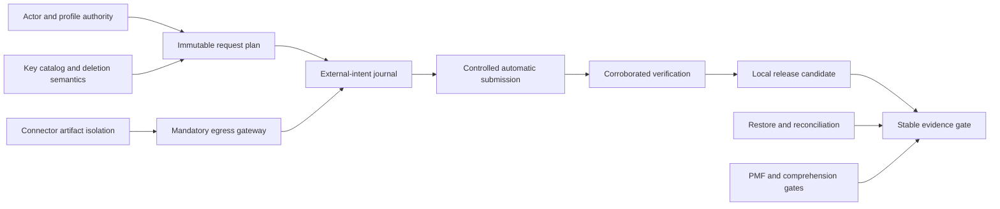

# MyCogni roadmap

The roadmap assumes three experienced implementation lanes. The issue backlog exceeds 300 ideal engineering-days before external work; one experienced full-time maintainer should plan roughly 75–90 calendar weeks plus reviewer, pilot, canary, and broker latency. Week ranges are a dependency-derived planning envelope that must be recalculated from M0 velocity. Release gates, not elapsed time, determine readiness.

## Product scope through stable v1

Stable v1 supports one consenting U.S. adult per installation, current and historical aliases, local-lite deployment, a small public support matrix, guided removal, 2–5 narrowly trusted automatic capabilities, independent rechecks, resurfacing, export/delete, and evidence-correct reporting.

It does not promise family administration, minors/guardians, a hosted multi-tenant service, arbitrary custom-site automation, blanket private-broker outreach, non-U.S. law, mobile apps, or an LLM dependency.

## Release train

| Target | Weeks | Product outcome | Engineering/security gate | Learning gate |
| --- | ---: | --- | --- | --- |
| Executable foundation | 0–4 | synthetic-only developer shell | locked build; simulator; hermetic network-deny CI; P0 spikes; stable threat/test IDs | research and comprehension protocols ready |
| Secure local kernel | 4–9 | encrypted identity, aliases, backup/restore health and durable local shell | auth/key isolation; SQLite/process model; jobs/evidence; generic action journal and online gateway base | separate discovery/retention/research consent ready |
| Preview alpha | 9–14 | separately authorized read-only exposure preview | exact scan disclosure; registry/artifact isolation; honest support matrix | preregistered usability/precision denominators; zero removal submissions |
| Guided beta | 14–19 | exact request/value preview, disclosure ledger, guided/manual and simulator-email flows | policy/authority provenance; immutable plan; attention digest; pre-submit offboarding | action-based proof and disclosure comprehension gates pass |
| Controlled automation | 19–26 | automatic submission for 2–5 trusted capabilities | typed transports; restore epoch; signed updates/artifacts; shared and capability human reviews | per-capability match/authority gate and bounded canaries pass |
| Local release candidate | 26–32 | corroborated outcomes, resurfacing, signed local artifacts | zero P0/no enabled P1; OCI/SBOM/provenance; restore/accessibility/resilience/external gates | preview/guided/automatic cohorts continue with honest denominators |
| Stable evidence gate | 32–40+ | stable claim earned or rejected | every stable gate reproduced; current claim matrix; at least two trusted capabilities | automatic cohort at least 12 weeks with mature day-90 denominator |
| Cloud-small | post-v1 | single-tenant small-cloud profile | PostgreSQL/object-store/KMS conformance, TLS/auth, disaster drill, no parity overclaim | operators deploy, restore, and estimate cost without maintainer intervention |
| Optional assist preview | post-v1 | one advisory local task in shadow/opt-in mode | no-authority proof, PII canaries, artifact/license governance, resource budgets, task TEVV | at least 30% review-time reduction without safety or accuracy regression |

## Critical dependency chain

No connector count can bypass this dependency chain.

## Maintainer decision gates

- Before preview alpha: confirm whether one adult per install remains the supported product contract.
- Before guided beta: obtain review of U.S. state policy sources and authorized-agent language.
- Before automation beta: select the first 2–5 candidate capabilities and qualified independent reviewers.
- Before stable v1: resolve the working name, publish the security review disposition, and approve the supported deployment statement.
- Before cloud-small (post-v1): choose the reference cloud/VM and secret provider.
- Before optional assist: approve one measured task, model/runtime license, hardware tier, and published evaluation card.

## Later opportunities

After stable v1 evidence: cloud-small, household accounts for separately consenting adults, state-policy maintainers, official-protocol transports with real trust-network access, a governed connector registry, metadata-only OpenClaw integration, custom-page guidance, and additional jurisdictions. Each expands the threat model and must earn its own ADR and release gates.

The issue-ready source of truth, including package dependencies and completion evidence, is [docs/v1](docs/v1/README.md).
