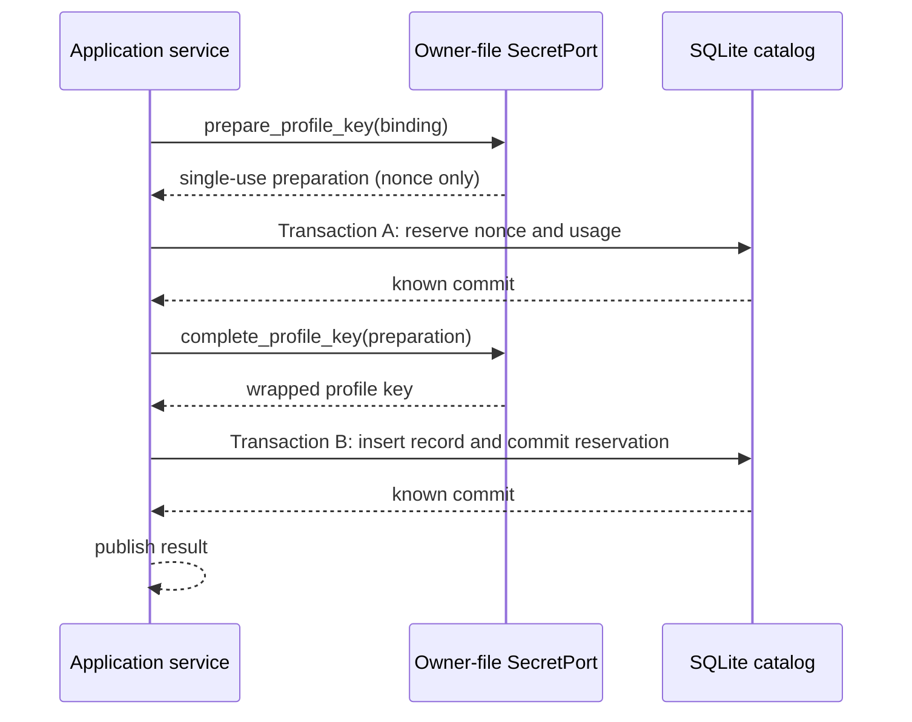
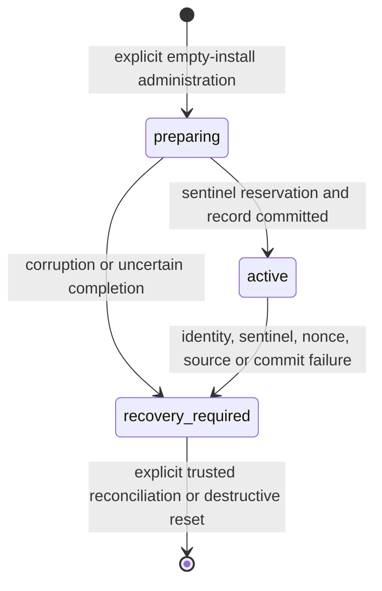

# ADR-0016: Durable wrapped-key catalog and nonce reservation

- Status: Accepted for initial build
- Date: 2026-07-31
- Scope: `KEY-001A`, an `IN_PROGRESS` precursor to `KEY-001`
- Refines: ADR-0007 and ADR-0013

## Context

SPIKE-KEY proves a strict AES-256-GCM profile-key record and a native owner-only-file KEK
provider, but its nonce ledger and usage accounting live only for one process. The provider also
previously generated a nonce, generated a profile DEK and encrypted it in one call. A durable
catalog could therefore record the nonce only after AEAD use. A crash at that boundary could lose
the only durable evidence that the nonce had already been used under the KEK.

MyCogni also needs routine restart to authenticate the exact catalog sentinel without discovering,
creating or repairing a key source. SQLite commit exceptions are not proof that a transaction did
not commit. Treating an uncertain reservation or publication as a normal failure would permit an
unsafe retry or a wrapped key that was returned before durable ownership was known.

## Decision

Add a normalized, version-1 SQLite catalog containing one immutable installation/catalog/sentinel
identity, the exact active provider/KEK reference, a finite state, a durable append-only nonce
ledger, a dedicated wrapped readiness sentinel and immutable wrapped synthetic profile-key
records. Trusted composition supplies the expected non-secret identity independently of catalog
loading and selects only the accepted native owner-file provider.

Profile-key creation is split across two known-successful transactions:

1. The provider creates a PID- and issuer-bound, single-use `ProfileKeyPreparation`. It validates
   readiness and reserves a fresh 96-bit nonce in the live KEK domain, but does not generate a DEK
   or perform AEAD.
2. Transaction A inserts that exact nonce as `reserved`, advances durable usage accounting and
   commits. A failed or abandoned operation burns the nonce.
3. The provider consumes the preparation before any completion work, generates an independent
   random 32-byte profile DEK, encrypts it with AES-256-GCM and scrubs its owned mutable buffer
   best-effort. Every completion outcome consumes the preparation.
4. Transaction B inserts the strict wrapped record, changes the reservation to `committed`,
   advances the catalog revision and commits atomically.
5. The application publishes the wrapped record only after Transaction B returns known success.

The durable catalog state is closed:

Routine startup never provisions, repairs or changes the external key source. It loads the strict
catalog, compares its complete identity with composition-pinned identity, requires `active`,
constructs the exact owner-file provider, authenticates the persisted sentinel and only then
admits key work. A failed existing-install readiness decision durably changes an `active` catalog
to `recovery_required`; restoring the source does not silently reopen the catalog. `preparing` is
not resumed by routine startup. Both states require an explicit, narrow reconciliation path, and
the outer SQLite recovery latch remains closed after dirty-start reconciliation.

Initialization is a separate empty-install administration ceremony. It commits the catalog in
`preparing` with a durably reserved sentinel nonce before sentinel AEAD, then publishes the
sentinel and changes the catalog to `active` in a second transaction. It never creates, replaces,
repairs, chmods or deletes the external owner-file KEK.

Any ambiguous SQLite commit latches recovery and returns only
`commit_outcome_unknown`. The caller receives no wrapped key and must not retry automatically.
On an ordinary failure after Transaction A, the reservation remains burned. Nonce and usage
accounting are scoped by provider-instance ID, KEK ID and KEK version; the sentinel counts as the
first use.

## Schema contract

- `key_catalog`: singleton schema/revision/state, immutable installation/catalog/sentinel IDs,
  exact provider and KEK reference, a domain-separated commitment to the original external key
  source, usage limit and reserved-use counter.
- `key_nonce_reservations`: append-only reservation ID, catalog and KEK-domain identity, exact
  12-byte nonce, `sentinel|profile` purpose, `reserved|committed|burned` lifecycle, monotonically
  unique usage sequence and optional profile binding.
- `key_readiness_sentinel`: one strict format-1/AAD-1/A256GCM, 48-byte ciphertext record linked to
  its committed nonce reservation.
- `wrapped_profile_keys`: immutable profile/version binding, installation and catalog-schema
  binding, strict format/AAD/suite/ciphertext and one unique committed nonce reservation.

The catalog stores no KEK and no plaintext profile DEK. Historical AAD inputs come from persisted
bindings rather than mutable current configuration. Unknown versions, malformed lengths,
uncommitted reservations, duplicate profile versions, usage exhaustion and any identity mismatch
fail closed.

## Accepted review findings

- **Cryptography:** reserve the nonce durably before AEAD; consume preparations on all completion
  outcomes; never retry an ambiguous cryptographic or commit operation.
- **Backend/infra:** use two transactions, serialize through the single SQLite writer, use
  compare-and-swap revisions and treat commit exceptions as outcome unknown.
- **Edge/restart:** keep routine startup non-mutating toward the external key source, never
  self-resume `preparing`, authenticate the persisted sentinel after a fresh process start and
  preserve burned reservations and usage limits across restart.
- **Architecture:** pin expected non-secret identity in trusted composition rather than accepting
  catalog-provided identity as its own trust anchor; keep persistence out of the key adapter.
- **Open source/operations:** make downgrade database-only, preserve operator custody, publish a
  finite redacted failure vocabulary and state unsupported provider profiles as open.
- **Product/security claims:** call this restart readiness for synthetic keys, not encrypted-vault,
  deletion, backup, rotation or production key-subsystem completion.

## Consequences

The design makes nonce use durable before encryption and gives restart a strict catalog/sentinel
path. It intentionally burns capacity on interrupted or duplicate work. Initialization and
profile creation require two durable commits. Recovery favors refusal and operator reconciliation
over automatic repair.

The catalog plus exact external KEK are both required for recovery. A fully compromised host,
operator copies and external filesystem snapshots remain outside the assurance boundary. Reusing
the same raw KEK in wholly separate catalogs cannot be globally prevented by one catalog; native
provisioning must not reuse key material.

## Migration and rollback

Alembic revision `0003_key_catalog` upgrades from `0002_auth_decision_state` and creates only the
four catalog tables. Fresh and upgrade paths must run under the existing SQLite ownership,
durability and migration-recovery policy.

Downgrade drops the wrapped-key catalog tables only. It never reads, creates, changes, repairs or
deletes the external owner-file source. Once the catalog contains keys, the operator-invoked
Alembic downgrade is an explicit destructive action against database recovery metadata; no
automated warning mechanism is implemented. It is not a key recovery mechanism. Rollback of the
code disables KEY-001A composition and leaves external custody untouched.

## Nonclaims

KEY-001A does not complete `KEY-001` or begin `KEY-002`/`DATA-001`. It provides no real-PII or
field/evidence encryption, profile UX, key rotation, deletion, archive-horizon enforcement,
backup/restore proof, broker traffic or external action. It makes no Keychain, container-volume,
Linux Secret Service, cloud-KMS, FIPS, Secure Enclave, memory-zeroization, hostile-host/root,
mount-alias, power-loss, cross-database KEK-reuse or independent human cryptographic-certification
claim. Formal V0.x-to-V1 promotion remains deferred.

## Review triggers

Catalog/AAD/schema change, new provider profile, rotation, recovery or restore design, archive
inventory, usage-limit change, nonce collision, commit-ambiguity drill failure, shared tenancy,
profile deletion, or any claim beyond the nonclaims above.
