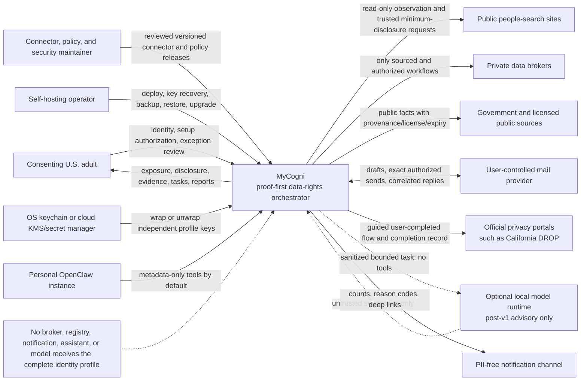

# System context

Context invariants:

- Stable v1 supports one consenting adult per installation; later profiles remain separately authorized.
- Official identity controls are user-completed, never bypassed.
- OpenClaw and optional local intelligence have no default vault, approval, or submission authority.
- “Supported” means a capability with visible maturity/freshness, not a broker metadata row.
