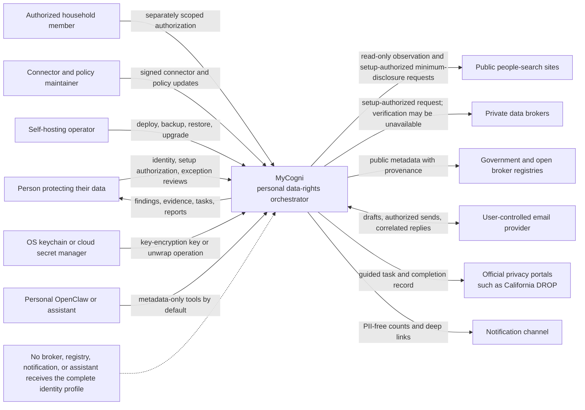

# System context

Context invariants:

- A household member does not inherit another profile's authority.
- Official portal identity controls are user-completed, not bypassed.
- Assistant and notification surfaces are outside the PII trust boundary.
