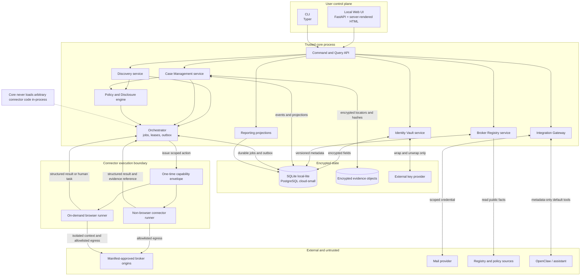

# Container and component architecture

```mermaid
flowchart TB
    subgraph control["User control plane"]
        ui["Local Web UI<br/>FastAPI + server-rendered HTML"]
        cli["CLI<br/>Typer"]
    end

    subgraph core["Trusted core process"]
        api["Command and Query API"]
        identity["Identity Vault service"]
        registry["Broker Registry service"]
        discovery["Discovery service"]
        cases["Case Management service"]
        policy["Policy and Disclosure engine"]
        reporting["Reporting projections"]
        gateway["Integration Gateway"]
        orchestrator["Orchestrator<br/>jobs, leases, outbox"]
    end

    subgraph state["Encrypted state"]
        db[("SQLite local-lite<br/>PostgreSQL cloud-small")]
        objects[("Encrypted evidence objects")]
        keys["External key provider"]
    end

    subgraph runtime["Connector execution boundary"]
        brokerRunner["Non-browser connector runner"]
        browserRunner["On-demand browser runner"]
        envelope["One-time capability envelope"]
    end

    subgraph external["External and untrusted"]
        broker["Manifest-approved broker origins"]
        email["Mail provider"]
        sources["Registry and policy sources"]
        openclaw["OpenClaw / assistant"]
    end

    ui --> api
    cli --> api
    api --> identity
    api --> registry
    api --> discovery
    api --> cases
    api --> reporting
    api --> gateway
    discovery --> policy
    cases --> policy
    discovery --> orchestrator
    cases --> orchestrator
    policy --> orchestrator

    identity <-->|"encrypted fields"| db
    registry <-->|"versioned metadata"| db
    cases <-->|"events and projections"| db
    orchestrator <-->|"durable jobs and outbox"| db
    reporting --> db
    identity <-->|"wrap and unwrap only"| keys
    cases <-->|"encrypted locators and hashes"| objects

    orchestrator -->|"issue scoped action"| envelope
    envelope --> brokerRunner
    envelope --> browserRunner
    brokerRunner -->|"allowlisted egress"| broker
    browserRunner -->|"isolated context and allowlisted egress"| broker
    brokerRunner -->|"structured result and evidence reference"| orchestrator
    browserRunner -->|"structured result or human task"| orchestrator

    gateway <-->|"scoped credential"| email
    registry -->|"read public facts"| sources
    gateway <-->|"metadata-only default tools"| openclaw

    guard["Core never loads arbitrary connector code in-process"]
    guard -.-> orchestrator
```

The same image exposes `serve`, `worker`, and `scheduler` roles. Local-lite co-locates roles but preserves module and subprocess boundaries.
