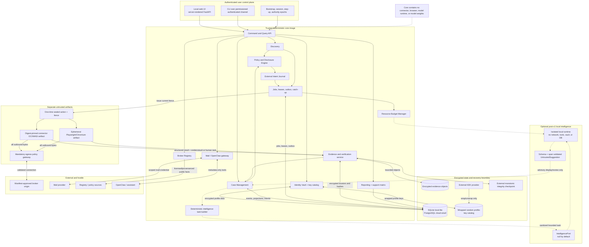

# Container and component architecture

The core image can co-locate trusted roles in local-lite. Runtime boundaries, authentication, gateway enforcement, key separation, and authority semantics remain intact.
