# Trust boundaries and PII flow

```mermaid
flowchart LR
    subgraph z1["Zone 1 — authenticated user control"]
        entry["Identity entry"]
        auth["Setup authorization / step-up"]
        preview["Disclosure and proof preview"]
        viewer["Safe evidence viewer"]
    end

    subgraph z2["Zone 2 — trusted deterministic core"]
        classify["Attribute classification"]
        decide["Policy + final dispatch decision"]
        journal["Intent, attempt, fence journal"]
        ledger["Disclosure ledger"]
        sanitize["Deterministic sanitizer/task builder"]
        redact["Redacted reporting projection"]
    end

    subgraph z3["Zone 3 — encrypted data and keys"]
        sealed[("Field-encrypted PII")]
        evidence[("Encrypted bounded evidence")]
        profileKeys[("Wrapped random profile DEKs")]
        kek["External installation/cloud KEK"]
        checkpoint["External integrity checkpoint"]
    end

    subgraph z4["Zone 4 — isolated action artifact"]
        action["One action envelope + current fence"]
        sandbox["Rootless connector/browser sandbox"]
        session["Connector/profile-specific session"]
    end

    subgraph z5["Zone 5 — mandatory egress enforcement"]
        gate["Fence, authority, origin/IP, method, disclosure, budget"]
    end

    subgraph z6["Zone 6 — hostile broker network/content"]
        endpoint["Approved broker endpoint"]
        hostile["Hostile page, mail, redirect, response"]
    end

    subgraph z7["Zone 7 — optional local intelligence"]
        model["No-network local runtime"]
        suggestion["UntrustedSuggestion"]
    end

    subgraph z8["Zone 8 — low-trust integration/diagnostics"]
        assistant["OpenClaw"]
        notifications["Notifications"]
        diagnostics["Metrics/support bundle"]
    end

    entry -->|"raw attributes over local/TLS channel"| classify
    classify -->|"encrypt with profile/purpose key"| sealed
    kek -->|"wrap/unwrap"| profileKeys
    profileKeys -->|"release scoped key material"| sealed
    sealed -->|"policy-requested categories only"| decide
    auth -->|"actor, profile, plan, epoch"| decide
    decide -->|"exact proposed bundle"| preview
    decide --> journal
    journal -->|"sealed minimum bundle + fence"| action
    action --> sandbox
    session --> sandbox
    sandbox -->|"all outbound bytes"| gate
    gate -->|"validated exact disclosure"| endpoint
    endpoint --> hostile
    hostile -->|"bounded response through gateway"| sandbox
    sandbox -->|"encrypted artifact + structured result"| evidence
    evidence --> viewer
    evidence --> checkpoint
    decide -->|"categories, destination, purpose, time"| ledger
    ledger --> redact
    evidence -->|"redacted derivative"| redact

    evidence -.->|"selected sanitized bounded content"| sanitize
    sanitize -.-> model
    model -.-> suggestion
    suggestion -.->|"display/review only; no command"| redact

    redact -->|"opaque cases, counts, tasks"| assistant
    redact -->|"counts, reasons, deep links"| notifications
    redact -->|"allowlisted fields only"| diagnostics

    deny["DENIED: full vault, raw prompt/evidence, reusable keys, core mounts, direct egress, tool authority"]
    deny -.-> sandbox
    deny -.-> model
    deny -.-> assistant
    deny -.-> diagnostics
```

A connector cannot request additional fields after launch. A model cannot become an actor, connector, policy source, or command producer. Every additional disclosure or authority change returns to the authenticated user/core boundary.
