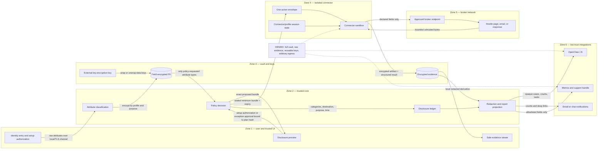

# Trust boundaries and PII flow

PII flow is capability-driven. A connector cannot ask the vault for more data; changing its disclosure schema requires a new reviewed connector release and user-visible diff.
