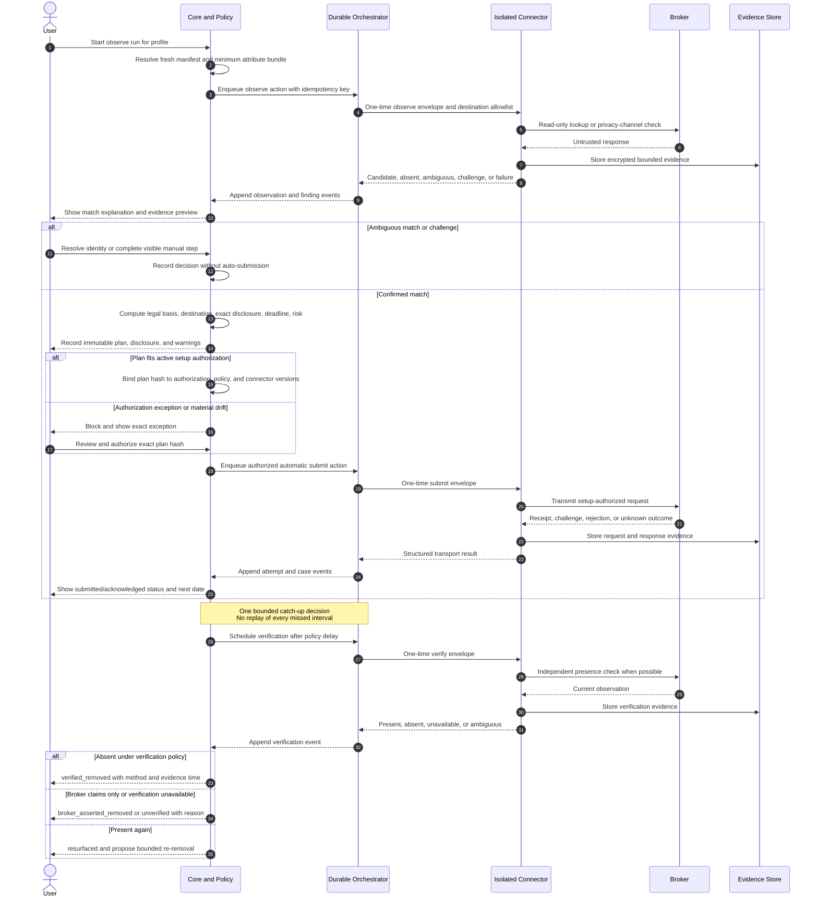

# Observe, submit, and verify sequence

```mermaid
sequenceDiagram
    autonumber
    actor U as User
    participant C as Core and Policy
    participant Q as Durable Orchestrator
    participant R as Isolated Connector
    participant B as Broker
    participant E as Evidence Store

    U->>C: Start observe run for profile
    C->>C: Resolve fresh manifest and minimum attribute bundle
    C->>Q: Enqueue observe action with idempotency key
    Q->>R: One-time observe envelope and destination allowlist
    R->>B: Read-only lookup or privacy-channel check
    B-->>R: Untrusted response
    R->>E: Store encrypted bounded evidence
    R-->>Q: Candidate, absent, ambiguous, challenge, or failure
    Q-->>C: Append observation and finding events
    C-->>U: Show match explanation and evidence preview

    alt Ambiguous match or challenge
        U->>C: Resolve identity or complete visible manual step
        C->>C: Record decision without auto-submission
    else Confirmed match
        C->>C: Compute legal basis, destination, exact disclosure, deadline, risk
        C-->>U: Record immutable plan, disclosure, and warnings
        alt Plan fits active setup authorization
            C->>C: Bind plan hash to authorization, policy, and connector versions
        else Authorization exception or material drift
            C-->>U: Block and show exact exception
            U->>C: Review and authorize exact plan hash
        end
        C->>Q: Enqueue authorized automatic submit action
        Q->>R: One-time submit envelope
        R->>B: Transmit setup-authorized request
        B-->>R: Receipt, challenge, rejection, or unknown outcome
        R->>E: Store request and response evidence
        R-->>Q: Structured transport result
        Q-->>C: Append attempt and case events
        C-->>U: Show submitted/acknowledged status and next date
    end

    Note over C,Q: One bounded catch-up decision<br/>No replay of every missed interval
    C->>Q: Schedule verification after policy delay
    Q->>R: One-time verify envelope
    R->>B: Independent presence check when possible
    B-->>R: Current observation
    R->>E: Store verification evidence
    R-->>Q: Present, absent, unavailable, or ambiguous
    Q-->>C: Append verification event
    alt Absent under verification policy
        C-->>U: verified_removed with method and evidence time
    else Broker claims only or verification unavailable
        C-->>U: broker_asserted_removed or unverified with reason
    else Present again
        C-->>U: resurfaced and propose bounded re-removal
    end
```

No transport response directly produces `verified_removed`.
