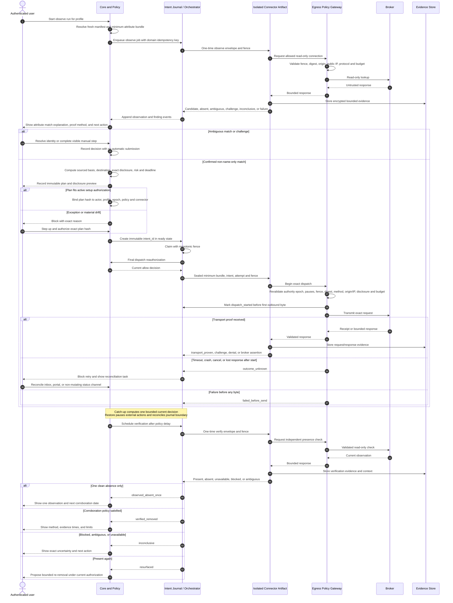

# Observe, dispatch, reconcile, and verify sequence

```mermaid
sequenceDiagram
    autonumber
    actor U as Authenticated user
    participant C as Core and Policy
    participant J as Intent Journal / Orchestrator
    participant R as Isolated Connector Artifact
    participant G as Egress Policy Gateway
    participant B as Broker
    participant E as Evidence Store

    U->>C: Start observe run for profile
    C->>C: Resolve fresh manifest and minimum attribute bundle
    C->>J: Enqueue observe job with domain idempotency key
    J->>R: One-time observe envelope and fence
    R->>G: Request allowed read-only connection
    G->>G: Validate fence, digest, origin, public IP, protocol and budget
    G->>B: Read-only lookup
    B-->>G: Untrusted response
    G-->>R: Bounded response
    R->>E: Store encrypted bounded evidence
    R-->>J: Candidate, absent, ambiguous, challenge, inconclusive, or failure
    J-->>C: Append observation and finding events
    C-->>U: Show attribute match explanation, proof method, and next action

    alt Ambiguous match or challenge
        U->>C: Resolve identity or complete visible manual step
        C->>C: Record decision with no automatic submission
    else Confirmed non-name-only match
        C->>C: Compute sourced basis, destination, exact disclosure, risk and deadline
        C-->>U: Record immutable plan and disclosure preview
        alt Plan fits active setup authorization
            C->>C: Bind plan hash to actor, profile, epoch, policy and connector
        else Exception or material drift
            C-->>U: Block with exact reason
            U->>C: Step up and authorize exact plan hash
        end
        C->>J: Create immutable intent_id in ready state
        J->>J: Claim with monotonic fence
        J->>C: Final dispatch reauthorization
        C-->>J: Current allow decision
        J->>R: Sealed minimum bundle, intent, attempt and fence
        R->>G: Begin exact dispatch
        G->>G: Revalidate authority epoch, pauses, fence, digest, method, origin/IP, disclosure and budget
        G->>J: Mark dispatch_started before first outbound byte
        G->>B: Transmit exact request
        alt Transport proof received
            B-->>G: Receipt or bounded response
            G-->>R: Validated response
            R->>E: Store request/response evidence
            R-->>J: transport_proven, challenge, denial, or broker assertion
        else Timeout, crash, cancel, or lost response after start
            G-->>J: outcome_unknown
            J-->>U: Block retry and show reconciliation task
            U->>C: Reconcile inbox, portal, or non-mutating status channel
        else Failure before any byte
            G-->>J: failed_before_send
        end
    end

    Note over C,J: Catch-up computes one bounded current decision<br/>Restore pauses external actions and reconciles journal boundary
    C->>J: Schedule verification after policy delay
    J->>R: One-time verify envelope and fence
    R->>G: Request independent presence check
    G->>B: Validated read-only check
    B-->>G: Current observation
    G-->>R: Bounded response
    R->>E: Store verification evidence and context
    R-->>J: Present, absent, unavailable, blocked, or ambiguous
    alt One clean absence only
        J-->>C: observed_absent_once
        C-->>U: Show one observation and next corroboration date
    else Corroboration policy satisfied
        J-->>C: verified_removed
        C-->>U: Show method, evidence times, and limits
    else Blocked, ambiguous, or unavailable
        J-->>C: inconclusive
        C-->>U: Show exact uncertainty and next action
    else Present again
        J-->>C: resurfaced
        C-->>U: Propose bounded re-removal under current authorization
    end
```

No transport response or model suggestion directly produces `verified_removed`. No post-dispatch timeout grants retry authority.
