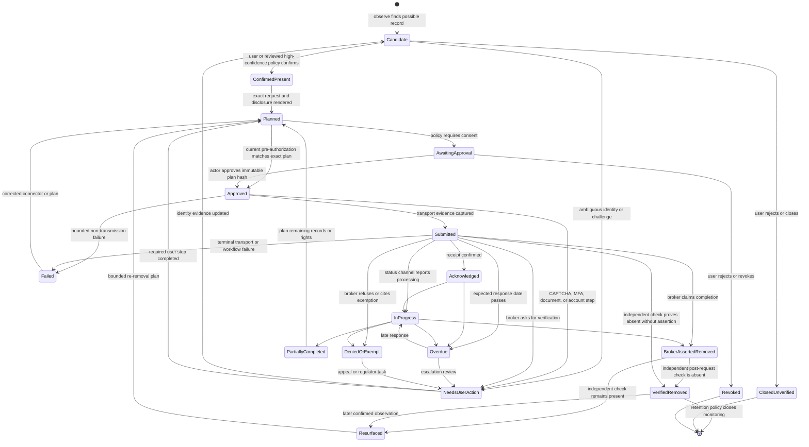

# Case lifecycle

```mermaid
stateDiagram-v2
    [*] --> Candidate: observe finds possible record
    Candidate --> ConfirmedPresent: user or reviewed high-confidence policy confirms
    Candidate --> ClosedUnverified: user rejects or closes
    Candidate --> NeedsUserAction: ambiguous identity or challenge
    NeedsUserAction --> Candidate: identity evidence updated
    NeedsUserAction --> Planned: required user step completed

    ConfirmedPresent --> Planned: exact request and disclosure rendered
    Planned --> AwaitingApproval: policy requires consent
    Planned --> Approved: current pre-authorization matches exact plan
    AwaitingApproval --> Approved: actor approves immutable plan hash
    AwaitingApproval --> Revoked: user rejects or revokes
    Approved --> Submitted: transport evidence captured
    Approved --> NeedsUserAction: CAPTCHA, MFA, document, or account step
    Approved --> Failed: bounded non-transmission failure

    Submitted --> Acknowledged: receipt confirmed
    Submitted --> InProgress: status channel reports processing
    Submitted --> NeedsUserAction: broker asks for verification
    Submitted --> Overdue: expected response date passes
    Submitted --> BrokerAssertedRemoved: broker claims completion
    Submitted --> DeniedOrExempt: broker refuses or cites exemption
    Submitted --> Failed: terminal transport or workflow failure

    Acknowledged --> InProgress
    Acknowledged --> Overdue
    InProgress --> BrokerAssertedRemoved
    InProgress --> PartiallyCompleted
    InProgress --> DeniedOrExempt
    InProgress --> Overdue
    Overdue --> InProgress: late response
    Overdue --> NeedsUserAction: escalation review

    BrokerAssertedRemoved --> VerifiedRemoved: independent post-request check is absent
    BrokerAssertedRemoved --> Resurfaced: independent check remains present
    Submitted --> VerifiedRemoved: independent check proves absent without assertion
    PartiallyCompleted --> Planned: plan remaining records or rights
    DeniedOrExempt --> NeedsUserAction: appeal or regulator task
    Failed --> Planned: corrected connector or plan

    VerifiedRemoved --> Resurfaced: later confirmed observation
    Resurfaced --> Planned: bounded re-removal plan
    VerifiedRemoved --> [*]: retention policy closes monitoring
    ClosedUnverified --> [*]
    Revoked --> [*]
```

The implementation uses events as source of truth and a projected current status. Resurfacing is a new occurrence linked to history, never a rewrite of prior evidence.
