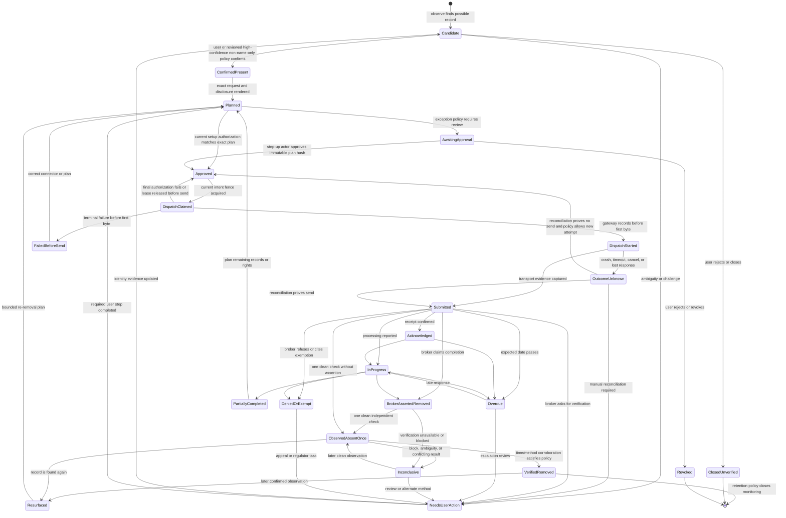

# Case lifecycle

```mermaid
stateDiagram-v2
    [*] --> Candidate: observe finds possible record
    Candidate --> ConfirmedPresent: user or reviewed high-confidence non-name-only policy confirms
    Candidate --> ClosedUnverified: user rejects or closes
    Candidate --> NeedsUserAction: ambiguity or challenge
    NeedsUserAction --> Candidate: identity evidence updated
    NeedsUserAction --> Planned: required user step completed

    ConfirmedPresent --> Planned: exact request and disclosure rendered
    Planned --> AwaitingApproval: exception policy requires review
    Planned --> Approved: current setup authorization matches exact plan
    AwaitingApproval --> Approved: step-up actor approves immutable plan hash
    AwaitingApproval --> Revoked: user rejects or revokes

    Approved --> DispatchClaimed: current intent fence acquired
    DispatchClaimed --> Approved: final authorization fails or lease released before send
    DispatchClaimed --> DispatchStarted: gateway records before first byte
    DispatchStarted --> Submitted: transport evidence captured
    DispatchStarted --> OutcomeUnknown: crash, timeout, cancel, or lost response
    DispatchClaimed --> FailedBeforeSend: terminal failure before first byte
    OutcomeUnknown --> Submitted: reconciliation proves send
    OutcomeUnknown --> Approved: reconciliation proves no send and policy allows new attempt
    OutcomeUnknown --> NeedsUserAction: manual reconciliation required

    Submitted --> Acknowledged: receipt confirmed
    Submitted --> InProgress: processing reported
    Submitted --> NeedsUserAction: broker asks for verification
    Submitted --> Overdue: expected date passes
    Submitted --> BrokerAssertedRemoved: broker claims completion
    Submitted --> DeniedOrExempt: broker refuses or cites exemption

    Acknowledged --> InProgress
    Acknowledged --> Overdue
    InProgress --> BrokerAssertedRemoved
    InProgress --> PartiallyCompleted
    InProgress --> DeniedOrExempt
    InProgress --> Overdue
    Overdue --> InProgress: late response
    Overdue --> NeedsUserAction: escalation review

    BrokerAssertedRemoved --> ObservedAbsentOnce: one clean independent check
    Submitted --> ObservedAbsentOnce: one clean check without assertion
    ObservedAbsentOnce --> VerifiedRemoved: time/method corroboration satisfies policy
    ObservedAbsentOnce --> Inconclusive: block, ambiguity, or conflicting result
    BrokerAssertedRemoved --> Inconclusive: verification unavailable or blocked
    Inconclusive --> ObservedAbsentOnce: later clean observation
    Inconclusive --> NeedsUserAction: review or alternate method

    PartiallyCompleted --> Planned: plan remaining records or rights
    DeniedOrExempt --> NeedsUserAction: appeal or regulator task
    FailedBeforeSend --> Planned: correct connector or plan

    VerifiedRemoved --> Resurfaced: later confirmed observation
    ObservedAbsentOnce --> Resurfaced: record is found again
    Resurfaced --> Planned: bounded re-removal plan
    VerifiedRemoved --> [*]: retention policy closes monitoring
    ClosedUnverified --> [*]
    Revoked --> [*]
```

`OutcomeUnknown` blocks blind retry. `ObservedAbsentOnce` is evidence, not a verified-removal claim. Resurfacing creates a linked occurrence and never rewrites prior evidence.
