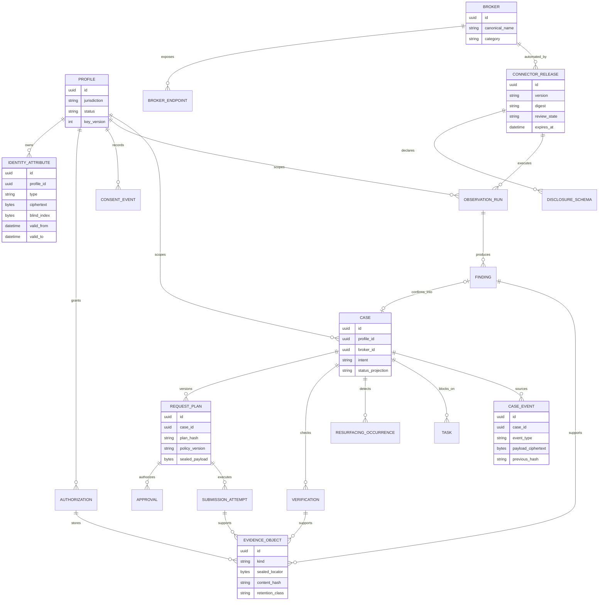

# Core data model

```mermaid
erDiagram
    PROFILE ||--o{ IDENTITY_ATTRIBUTE : owns
    PROFILE ||--o{ AUTHORIZATION : grants
    PROFILE ||--o{ CONSENT_EVENT : records
    PROFILE ||--o{ OBSERVATION_RUN : scopes
    PROFILE ||--o{ CASE : scopes

    BROKER ||--o{ BROKER_ENDPOINT : exposes
    BROKER ||--o{ CONNECTOR_RELEASE : automated_by
    CONNECTOR_RELEASE ||--o{ DISCLOSURE_SCHEMA : declares
    CONNECTOR_RELEASE ||--o{ OBSERVATION_RUN : executes

    OBSERVATION_RUN ||--o{ FINDING : produces
    FINDING o|--o| CASE : confirms_into
    CASE ||--o{ REQUEST_PLAN : versions
    REQUEST_PLAN ||--o{ APPROVAL : authorizes
    REQUEST_PLAN ||--o{ SUBMISSION_ATTEMPT : executes
    CASE ||--o{ VERIFICATION : checks
    CASE ||--o{ RESURFACING_OCCURRENCE : detects
    CASE ||--o{ TASK : blocks_on
    CASE ||--o{ CASE_EVENT : sources

    FINDING ||--o{ EVIDENCE_OBJECT : supports
    SUBMISSION_ATTEMPT ||--o{ EVIDENCE_OBJECT : supports
    VERIFICATION ||--o{ EVIDENCE_OBJECT : supports
    AUTHORIZATION ||--o{ EVIDENCE_OBJECT : stores

    PROFILE {
        uuid id
        string jurisdiction
        string status
        int key_version
    }
    IDENTITY_ATTRIBUTE {
        uuid id
        uuid profile_id
        string type
        bytes ciphertext
        bytes blind_index
        datetime valid_from
        datetime valid_to
    }
    BROKER {
        uuid id
        string canonical_name
        string category
    }
    CONNECTOR_RELEASE {
        uuid id
        string version
        string digest
        string review_state
        datetime expires_at
    }
    CASE {
        uuid id
        uuid profile_id
        uuid broker_id
        string intent
        string status_projection
    }
    REQUEST_PLAN {
        uuid id
        uuid case_id
        string plan_hash
        string policy_version
        bytes sealed_payload
    }
    CASE_EVENT {
        uuid id
        uuid case_id
        string event_type
        bytes payload_ciphertext
        string previous_hash
    }
    EVIDENCE_OBJECT {
        uuid id
        string kind
        bytes sealed_locator
        string content_hash
        string retention_class
    }
```

Readable PII is absent from the relational model. Ciphertext is bound to record and field context; blind indexes exist only for approved equality lookups.
