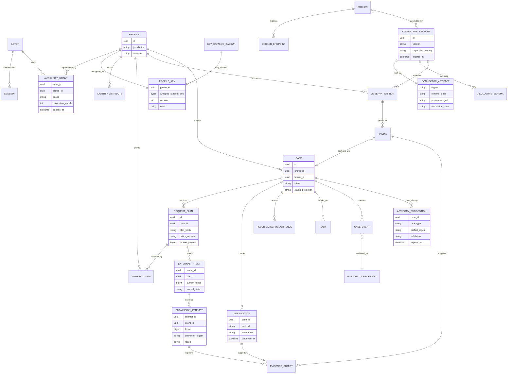

# Core data model

Readable PII is absent from relational fields. The wrapped-key catalog is a separate recovery asset. An advisory suggestion is encrypted, expiring, and never a domain event or decision source.
