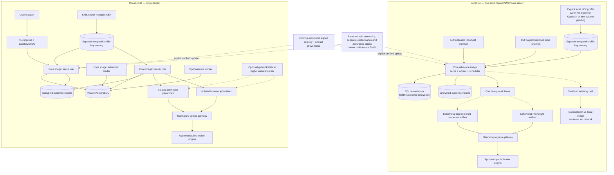

# Deployment profiles

The core, connector, browser, gateway, and optional model are distinct artifacts/processes. Local shared-kernel isolation is explicitly lower assurance than a hardened cloud sandbox. Active model resources are excluded from core idle claims and are never required.

This is a target-profile diagram. The native POSIX-mode owner-file source has source/fixture
evidence only. A macOS Security.framework helper cannot be called directly from the Linux
container; a container key-only volume needs separate rootless Linux Engine and Docker Desktop
evidence; cloud KMS is post-v1. None is inferred from the others.
