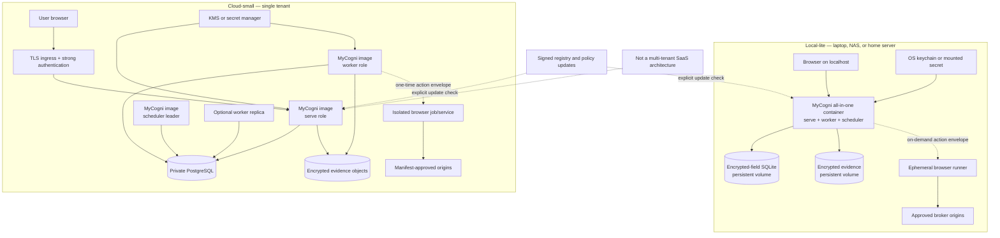

# Deployment profiles

```mermaid
flowchart TB
    subgraph local["Local-lite — laptop, NAS, or home server"]
        browser["Browser on localhost"] --> allinone["MyCogni all-in-one container<br/>serve + worker + scheduler"]
        allinone --> sqlite[("Encrypted-field SQLite<br/>persistent volume")]
        allinone --> files[("Encrypted evidence<br/>persistent volume")]
        hostkey["OS keychain or mounted secret"] --> allinone
        allinone -.->|"on-demand action envelope"| localrunner["Ephemeral browser runner"]
        localrunner --> internet1["Approved broker origins"]
    end

    subgraph cloud["Cloud-small — single tenant"]
        client["User browser"] --> ingress["TLS ingress + strong authentication"]
        ingress --> serve["MyCogni image<br/>serve role"]
        scheduler["MyCogni image<br/>scheduler leader"] --> pg[("Private PostgreSQL")]
        serve --> pg
        worker1["MyCogni image<br/>worker role"] --> pg
        worker2["Optional worker replica"] --> pg
        serve --> object[("Encrypted evidence objects")]
        worker1 --> object
        kms["KMS or secret manager"] --> serve
        kms --> worker1
        worker1 -.->|"one-time action envelope"| cloudrunner["Isolated browser job/service"]
        cloudrunner --> internet2["Manifest-approved origins"]
    end

    registry["Signed registry and policy updates"] -.->|"explicit update check"| allinone
    registry -.->|"explicit update check"| serve

    warning["Not a multi-tenant SaaS architecture"]
    warning -.-> serve
```

Both profiles use the same versioned application image and domain model. Cloud-small separates roles for reliability; it does not pool unrelated users.
