# Decision authority and optional local intelligence

```mermaid
flowchart LR
    subgraph truth["Authoritative deterministic path"]
        actor["Authenticated actor + profile authority"]
        sources["Versioned policy and connector facts"]
        match["Attribute-level deterministic match policy"]
        disclose["Minimum-disclosure computation"]
        plan["Immutable plan + authorization hash"]
        dispatch["Fenced journal + egress gateway"]
        evidence["Verification policy + evidence"]
        state["Domain state transition"]

        actor --> plan
        sources --> match
        sources --> disclose
        match --> plan
        disclose --> plan
        plan --> dispatch
        dispatch --> evidence
        evidence --> state
    end

    subgraph advisory["Optional local advisory path — post-v1"]
        hostile["Untrusted page/mail/structured events"]
        sanitize["Deterministic selection, normalization, PII redaction, caps"]
        port["Typed IntelligencePort"]
        runtime["Digest-pinned isolated local runtime<br/>no network, tools, vault, DB, or conversation"]
        validate["Schema + literal supporting-span validator"]
        suggestion["Encrypted expiring UntrustedSuggestion"]
        review["Human/advisory display"]

        hostile --> sanitize --> port --> runtime --> validate --> suggestion --> review
    end

    structured["PII-free reason codes / sanitized derivatives"] -.-> sanitize
    review -.->|"may prompt a human to inspect authoritative evidence"| actor

    deny["No edge from a suggestion to match, policy, deadline, disclosure, trust, verification, retry, or dispatch"]
    deny -.-> suggestion
    budget["Shared ResourceBudgetManager<br/>deadline/browser work wins"] -.-> runtime
    fallback["Unavailable, invalid, OOM, timeout, uncited → abstain<br/>deterministic product continues"] -.-> port
```

The validator can reject output; it cannot make a suggestion safe enough to become authority. The absence of any edge from the advisory lane to the command/state lane is a normative architecture rule.
