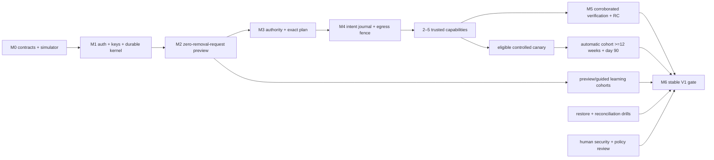

# Stable V1 implementation plan

Plan baseline: 2026-07-15. This is the detailed successor to the release-level outline in `docs/10-execution-plan.md`.

## 1. V1 completion contract

Stable V1 is proven only when one consenting U.S. adult can install local-lite, authenticate, manage encrypted current and historical identity attributes, run a bounded exposure preview, understand and correct matches, prepare exact minimum-disclosure plans, complete guided workflows, enable 2–5 independently reviewed automatic capabilities, see honest evidence states, receive recurring verification/resurfacing work, and safely pause, export, back up, restore, delete, and uninstall.

Stable V1 also requires:

- signed amd64 and arm64 artifacts with SBOM and provenance;
- zero unresolved P0 findings and no unresolved P1 on any enabled stable capability; a P1 surface must be fixed or removed/disabled from the stable artifact and support matrix;
- separate recurring preview, guided, and automatic cohorts, including at least twelve weeks and a mature day-90 denominator for automatic behavior included in the stable claim;
- a generated capability matrix that does not turn metadata or observe-only coverage into a submit claim;
- no remote telemetry, model runtime, model weights, or AI decision path;
- no real PII or live broker traffic in CI, examples, issues, or public fixtures.

Cloud-small is not part of stable V1. A shared domain contract does not establish cloud deployment support.

### Release-channel boundary

- `v0.x` may publish reproducible architecture, simulator, synthetic UI, local
  contracts and explicitly non-production spikes without any model-provider
  trusted-access enrollment.
- Until qualified external review is complete, those artifacts remain
  developer-preview and synthetic-only; they do not observe or submit to a live
  broker and make no security-certification claim.
- The `v0.x` to `v1` transition requires the shared auth/key/backup/runner/gateway/
  journal human review and every capability-specific policy/legal and second
  connector review named below. AI review availability does not satisfy or block
  those human gates.
- A filtered automated review is a recorded non-verdict. Implementation may continue
  behind the same fail-closed release boundary using deterministic tests and other
  independent review hats.

## 2. Honest schedule correction

The previous roadmap placed controlled automation in weeks 11–14 and stable V1 in weeks 15–18 while also requiring a twelve-week recurring beta. Those statements cannot both be true. Preview evidence cannot validate automatic disclosure, unknown outcomes, verification or resurfacing that does not yet exist.

The corrected planning envelope is M0 weeks 0–4, M1 weeks 4–9, M2 weeks 9–14, M3 weeks 14–19, M4 weeks 19–26, M5 weeks 26–32, and stable evidence evaluation during weeks 32–40 or later. The automatic cohort starts only after the first protected capability canary; stable V1 is eligible no earlier than week 40 and only after that cohort has at least twelve weeks of evidence and a mature day-90 denominator.

This envelope assumes three experienced implementation lanes and prompt reviewer/pilot availability. The current backlog contains more than 300 ideal engineering-days before external work; a single experienced full-time maintainer should plan roughly 75–90 calendar weeks. The schedule is recomputed from actual M0 velocity and external lead times, and is not a delivery promise.

## 3. Reference implementation contract

### Core stack

- Python 3.12 deployment baseline, with Python 3.13 compatibility in CI; do not use version-specific behavior until the compatibility matrix passes.
- One `uv` project and committed lockfile. CI uses locked/frozen resolution; dependency upgrades are deliberate review events. `uv` documents lock validation and cross-platform project locking in its [official project guidance](https://docs.astral.sh/uv/concepts/projects/sync/).
- FastAPI control plane with server-rendered Jinja templates and small project-owned JavaScript; no SPA framework in V1.
- Typer CLI that invokes the same application command/query handlers and never opens the database directly.
- Synchronous SQLAlchemy 2 and Alembic over SQLite WAL for the one-worker local-lite profile.
- Pydantic v2 at entrypoint and protocol boundaries; domain objects remain framework independent.
- Database-backed jobs, leases, scheduler state, outbox, and external-intent journal; no Redis, Celery, or hosted queue.
- `cryptography` primitives through typed ports; AES-256-GCM with fresh nonces, HKDF-SHA-256 purpose keys below independent random profile DEKs, and versioned associated data.
- Pytest, Hypothesis, Ruff, strict mypy, import-linter, migration tests, PII canaries, failure injection, and architecture tests.

Exact patch versions and image digests are frozen by M0 after clean-clone, amd64/arm64, and Playwright compatibility spikes. V1 code does not depend on UUIDv7; application-generated UUIDv4 opaque IDs avoid a time/clock dependency.

### Process and container topology

```text
Authenticated browser / permissioned CLI
                   |
         core all-in-one container
  API + UI + worker + scheduler + SQLite
          | sealed one-time mailbox
          v
  predeclared connector service (per capability)
          | internal-only connector network
          v
   mandatory egress policy gateway
          | exact fenced connection
          v
        approved endpoint
```

- The core image contains no connector, browser, model runtime, or model weight.
- V1 connector services are statically declared by immutable digest in Docker Compose. The core receives no Docker/containerd socket and cannot dynamically install or launch community artifacts.
- Each connector receives one expiring encrypted/signed envelope, has its own mailbox and internal network, and cannot mount core/data/key volumes.
- A separate egress service is the only component attached to connector networks and an outbound network. M0 includes an executable spike to decide the implementation language and TLS enforcement contract; the reference choice is a small static Go service unless the spike records a safer alternative in an ADR.
- Browser capabilities live in project-owned connector-specific Playwright/Chromium images, run non-root with a verified browser sandbox, private shared memory, pinned seccomp and no `SYS_ADMIN` or host IPC. Playwright's official image is a development/testing base, not a production security boundary; M0 must prove the project-owned image on each supported runtime and architecture.
- Inside the isolated core container the server binds its container interface; Compose publishes it explicitly to host `127.0.0.1`. Configuration lint rejects wildcard host publication, host networking, extra published service ports and untested IPv6. LAN mode is unsupported in stable V1.
- SQLite runs one application worker and one scheduler. `synchronous=FULL` is required for the external-intent journal; filesystem conformance is part of the supported-host matrix.

### Transport enforcement contract

| Transport | Enforceable V1 boundary |
| --- | --- |
| Declarative HTTP | the trusted gateway originates the exact typed request; connector code receives no generic tunnel |
| Mail | a dedicated trusted mailer originates the exact recipient, headers and body; connector code receives no mail credential |
| Browser | the gateway enforces permit, origin/IP/port, time and byte limits; opaque TLS prevents method/path/body inspection and leaves an allowed-origin exfiltration residual risk |
| Guided/manual | no automatic external-action claim |

The first trusted automatic capabilities must use a transport whose claimed disclosure guarantee is actually enforceable. A browser capability cannot earn trust merely because a CONNECT proxy restricts its origin.

### Package boundaries

```text
src/mycogni/
  domain/          # entities, value types, state machines; stdlib only
  application/     # commands, queries, services, ports, DTOs
  adapters/        # sqlite, crypto, keys, evidence, checkpoints, mail
  entrypoints/     # api, web, cli, worker, scheduler
  bootstrap/       # composition and configuration
packages/connector_protocol/
services/egressd/
connectors/synthetic_*/
simulator/
deploy/local-lite/
tests/{unit,contract,integration,adversarial,e2e,failure_injection}/
```

Domain imports only approved domain modules. Application imports domain and ports. Adapters implement ports. Entrypoints compose handlers. Connector protocol contains schemas and cryptographic-envelope types only; connectors are never imported into core.

## 4. Stable interfaces to freeze before parallel adapters

M0/M1 freeze these contracts before product and boundary work diverge:

- `Clock`, `OpaqueId`, `Sensitive[T]`, `Redacted[T]`, `Ciphertext`, typed result and reason-code contracts;
- synchronous `UnitOfWork`, repositories, command/query dispatcher, optimistic version contract;
- `SecretPort`, `VaultPort`, `EvidencePort`, `CheckpointPort`, and backup format SPI;
- actor/session/authority/step-up decision types and revocation epochs;
- registry snapshot, connector release/capability, disclosure schema, and match-policy DTOs;
- observation envelope/result and finding-signal taxonomy;
- canonical request-plan JSON and hash version;
- case event envelope, event authentication, projection/upcast contract;
- job/lease/deduplication and bounded catch-up semantics;
- external intent, attempt, fence, dispatch permit, transport proof, and reconciliation states;
- sealed connector action envelope and egress first-byte permit protocol.

Only the core lane authors Alembic migrations. Other lanes submit a schema proposal against a frozen interface.

## 5. Milestones

### M0 — executable foundation, weeks 0–4

User-visible result: a synthetic-only developer shell, CLI and deterministic simulator with no possible external submission. Authentication work is a prototype until the M1 security gate passes.

Deliver:

- locked Python/tooling project, package boundaries, CI and release-status guard;
- initial database/migration harness and typed ports;
- synthetic identity corpus, PII canaries, and broker web/mail simulator;
- destination/network deny harness proving CI cannot contact a real broker;
- local bootstrap/session, key-provider, transport/egress, browser-runtime and backup-format spikes;
- safe typed diagnostics, stable threat IDs, process/SQLite durability decisions, and a transport enforcement matrix;
- three-worktree and adversarial-review automation documented and exercised;
- traceability validator linking each work package to requirements, threats, ADRs, tests, and evidence.

Exit:

- clean clone builds and tests from the committed lockfile;
- development `serve`, worker/scheduler components, CLI, migrations, and simulator boot locally;
- live mail, browser, submit, custom network, and remote telemetry paths are absent or deny-by-default;
- every P0 spike has an accepted ADR or a named blocker; no placeholder is described as a security boundary;
- public/UI status remains “developer preview — synthetic only.”

### M1 — secure local kernel and outbound-action base, weeks 4–9

User-visible result: authenticated setup for one adult, encrypted aliases, key/backup health, durable jobs/events, and a restart-safe local-lite shell.

Deliver:

- one-time bootstrap, opaque server session, Host/Origin/CSRF/cookie controls;
- CLI Unix-socket or Compose-exec channel, step-up ceremony, and revocation epochs;
- profile/attribute model, independent random profile DEK, wrapped-key catalog, versioned AAD, rotation/deletion skeleton;
- SQLite UoW, case-event stream, keyed chain, external checkpoint, durable jobs, outbox, bounded scheduler catch-up;
- encrypted filesystem evidence store with staging, hashes/MACs, derivatives, retention and abandoned-object sweep;
- backup create/verify dry-run and configuration/secret lint;
- separate consent for local collection, read-only discovery disclosure, evidence retention, local product events and research export;
- a generic outbound-action journal, pause epoch, online first-byte authorization and gateway base used by every live observation, custom and submission action;
- an installation dispatch epoch outside data backups; restore rotates it, invalidates mailboxes, starts paused and reconciles all nonterminal external intents;
- server-rendered setup and health UI meeting keyboard, focus, zoom, and non-color status requirements.

Exit: auth, cross-profile, key substitution, interrupted rotation, event tamper, lease, catch-up, evidence corruption, backup, restart, and PII-canary tests pass. No observe or submit capability exists in the release artifact.

### M2 — zero-removal-request exposure preview alpha, weeks 9–14

User-visible result: a small read-only preview with explainable candidates, denominators, evidence, cases, tasks, and a generated support matrix.

Deliver:

- versioned broker registry with provenance, expiry, revocation, maturity and per-capability support;
- separate synthetic and approved read-only connector artifacts;
- signed monotonic trust/revocation freshness and signer/digest/SBOM/provenance verification before the first identity-disclosing live observation;
- exact scan-disclosure preview and separate observation authorization; preview consent never implies removal authorization;
- runner/mailbox isolation and read-only egress policy enforcement through the M1 action journal/gateway;
- observation runs, findings, deterministic broker-specific matching and user dispositions;
- case list/detail/timeline showing reason, owner, last evidence, next action and date;
- local-only product-event ledger and explicit redacted research export;
- preview pilot facilitator pack with no external request path.

Exit: removal submit is absent from built artifacts; every real observation is an authorized, disclosed external action; malicious connector tests cannot read core state or reach non-approved destinations; months of downtime produce one bounded current decision; name-only matches never auto-confirm; backup and restart recovery pass.

Learning gate LG-1 is a preview-usability gate, never automatic authorization: 10–15 target users; preregistered setup timing and usefulness definitions; at least 95% participant-confirmed precision with denominators; zero name-only auto-confirmations; and zero removal/opt-out submissions. Automatic match eligibility is evaluated later per capability with an independently reviewed corpus, preregistered minimum denominator/confidence bound, collision/ambiguity cases and zero known unattended wrong-person canaries.

### M3 — guided request beta, weeks 14–19

User-visible result: exact plans and disclosures, setup authorization, manual/email drafts, proof vocabulary, pause/revoke, export/delete/restore, and custom-URL guidance without automatic send.

Deliver:

- versioned voluntary/state policy facts and actor/profile authority;
- explicit self-attestation versus verified-control evidence and capability-specific authority requirements; unproven authority stays guided/manual;
- setup-authorization explainer and bounded grant;
- deterministic minimum-disclosure planner, canonical plan hash and exception decisions;
- exact value/destination/path/transport/message/attachment disclosure diff and ledger plus guided manual workflow; optional values may be removed and required-value removal makes the plan ineligible;
- simulator-only email draft and reply-correlation contracts; production send remains disabled;
- safe custom URL intake through the egress boundary, limited to reviewed guidance/draft;
- proof ladder, deadlines, reason codes, local attention digest, global/profile/broker pause, export, deletion-horizon and pre-external-action restore UI;
- `IntelligencePort` null adapter and no-authority contract only; no runtime/model/evaluation dependency.

Exit: complete plans and evidence are prepared without transmission; every destination, basis, version, attachment, warning and field category is inspectable; user can pause, revoke, export, delete and restore; model absence changes nothing.

Learning gates LG-2/LG-3: nobody mistakes HTTP success, acknowledgement, broker assertion, or one absence for verified removal; at least 80% identify the next action unaided; every automation-pilot participant identifies the destination organization/transport, exact current/historical value set, message/attachments, why each value is required, and changes since prior authorization. A miss blocks `AUTO-CONSENT-001` and automatic beta.

### M4 — controlled automation beta, weeks 19–26

User-visible result: setup-authorized automatic transmission for only 2–5 separately trusted capabilities, with challenge stops, kill switches, disclosure evidence, and unknown-outcome reconciliation.

Deliver:

- capability-specific promotion/quarantine/revocation with immutable artifact/SBOM/provenance references;
- signed monotonic update/revocation metadata, startup freshness enforcement, artifact signature/provenance verification and signed deployment inventory;
- immutable intent, separate attempts, monotonic fences and full dispatch journal;
- online first-byte `authorize_and_start`: the core durably records `dispatch_started` before the gateway may dial; verifier unavailable or uncertain persistence fails closed;
- declarative mail transport and isolated Playwright path through synthetic simulator first;
- challenge/intervention task UX, no bypass path, and guarded reconciliation;
- global/profile/broker/capability pause epochs;
- shared auth/key/backup/runner/gateway/journal human review before any canary, plus capability-specific policy/legal and second connector/security review;
- controlled canary procedure and one issue/review record per live capability.

Exit: stale dispatch epoch/fence/revocation/pause/quarantine/expiry/drift cannot emit a first byte; every restored nonterminal external intent requires reconciliation; every kill point yields authoritative pre-send proof, transport proof or unknown outcome; no blind retry exists. If fewer than two capabilities earn trust, the product remains beta/RC and cannot silently redefine stable V1.

Governance gate: each live submit capability needs qualified human policy/legal review and a second qualified connector/security reviewer. An AI adversarial review does not satisfy that requirement.

### M5 — local release candidate, weeks 26–32

User-visible result: corroborated verification, resurfacing, digest, complete offboarding, signed artifacts, tested install/upgrade/restore and a stable-candidate support matrix.

Deliver:

- versioned verification policy, independent checks, one-absence/inconclusive UI and resurfacing occurrences;
- denominator-preserving local effectiveness/burden/disclosure reporting;
- backup restore with journal-boundary reconciliation; profile export and cryptographic deletion horizon;
- signed amd64/arm64 core, gateway, connector and browser artifacts with SBOM/provenance;
- fresh install, upgrade, declared rollback window, pause, uninstall and key-loss runbooks;
- disk-full, OOM, clock-skew, abrupt-power, migration, restore and compromised-connector drills;
- WCAG 2.2 AA, keyboard, 200% zoom, reduced-motion and destructive-flow review;
- external cryptography/auth/gateway/journal and U.S. policy review disposition.

Exit: all local conformance gates pass; total idle application-service RSS/CPU is measured for core, gateway and supported idle connector services; browser peak, image/cache disk, backup scratch and upgrade free-space are published separately; zero P0 and no enabled-capability P1 remain; release is labeled `v1.0.0-rc`, not stable.

### M6 — stable evidence hold, weeks 32–40 or later

User-visible result: the release candidate operates through a recurring pilot, fixes findings without weakening evidence semantics, and earns or fails the stable claim.

Deliver:

- separate preview, guided and automatic cohorts; at least twelve weeks after the first eligible automatic canary and a mature day-90 denominator for automatic behavior;
- precision, verified outcomes by method/age, asserted-but-unverified age, disclosure cost, unknown outcomes, resurfacing, manual minutes, quarantine, backup/restore and offboarding results;
- final product-comprehension, security, policy, accessibility and OSS sustainability disposition;
- stable claim/support matrix generated from current evidence and connector freshness;
- release-candidate upgrade path and signed `v1.0.0` only after every safety gate; product-viability failures keep the project in beta/research even when a technical artifact is supportable.

Initial learning hypotheses: under ten manual minutes per active month and at least 60% day-90 scheduler retention. They are not marketing promises and may fail without invalidating the integrity of the experiment.

## 6. Critical path



No UI polish, connector count, elapsed week, or green narrow test bypasses this chain.

## 7. P0 decisions and spikes

| Decision | Default direction | Required evidence | Deadline |
| --- | --- | --- | --- |
| Local authentication/recovery | interactive CLI reveals one-use material without logging; opaque session and CLI-minted step-up; no password recovery | replay, expiry, logs/history/referrer leakage, DNS rebinding, CSRF, headless/NAS and lost-session prototype | M0 |
| Local KEK provider | host helper or mode-0600 secret file; KEK/recovery material outside the managed archive, whose wrapped catalog remains recoverable | macOS, Linux and rootless-Docker permissions/recovery spike | M0 |
| Transport/egress boundary | gateway-owned typed HTTP and mail transports; browser limited to origin/IP/port/budgets with explicit opaque-TLS residual risk | typed request equality plus CONNECT, redirect, DNS rebinding, browser proxy and verifier-unavailable tests | M0 |
| Connector launch model | predeclared digest-pinned Compose services; no Docker socket | mailbox replay/isolation and internal-network tests on Linux and Docker Desktop | M0 |
| Backup/recovery format | archive includes wrapped-DEK catalog, encrypted data/evidence, schema, object manifest, checkpoint statement and journal boundary; excludes KEK, recovery/checkpoint signing secrets, live dispatch epoch and plaintext | SQLite online snapshot, truncation, wrong key, interruption, metadata leakage, consistency and large-object spike | M0 |
| External checkpoint | mode-0600 control path outside DB/data volume with independent key | mutation, truncation, rollback, missing checkpoint and restore tests | M1 |
| SQLite assurance | field/object encryption; encrypted host volume recommended, no SQLCipher claim unless separately adopted | plaintext scan, WAL/backup metadata review and filesystem matrix | M1 |
| First connector set | choose low-disclosure, clear voluntary/policy paths with independent verification | terms/policy/source/disclosure/transport/reviewer worksheet | before M3 |
| Transport proof/reconciliation | defined separately per mail/browser capability | synthetic timeout/crash/duplicate/correlation corpus | before M4 |
| Dispatch/restore epoch | monotonic installation epoch outside data backup; online `authorize_and_start`; restore rotates epoch, purges mailboxes and reconciles every nonterminal intent | restore of pre-boundary ready/claimed/started states and kill-at-every-gateway-edge tests | before live observation |
| Secure updates and artifact identity | offline-pinned threshold root, signed monotonic expiry/revocation metadata and verified manifest/digest/SBOM/provenance inventory | rollback, freeze, wrong signer, revoked digest, mirror compromise and offline restart tests | before any live observation |
| Human review readiness | separate shared-boundary and capability-specific independent reviewers with recorded qualifications, conflicts, scope, digest, expiry and triggers | accepted review scopes and target windows | recruit in M1; complete before canary |

## 8. Explicit V1 exclusions

- household, guardian, minor, multi-person UI or shared administration;
- non-U.S. support claims;
- cloud-small/PostgreSQL support, object storage, KMS, OIDC/passkey reference profile, multiple workers or hosted service;
- dynamic connector installation, Docker-socket supervisor, arbitrary community artifacts or WASI ecosystem;
- blanket private-broker outreach or hundreds-of-brokers strategy;
- arbitrary custom-site automatic submission;
- CAPTCHA, MFA, rate-limit, terms or account-control bypass;
- model runtime, weights, remote AI, local-vault RAG or AI decisions;
- OpenClaw approve/submit/write or raw-evidence access;
- mobile, dark-web, breach, credit, insurance, VPN, reputation or public-record correction product scope.

## 9. Release and claim policy

One machine-readable release status must drive README/site/UI/report language: `architecture`, `developer_preview`, `preview_alpha`, `guided_beta`, `automation_beta`, `release_candidate`, or `stable_v1`.

Only M6 may set `stable_v1`. A connector build passing CI remains experimental; only per-capability promotion may mark it trusted. Stable artifacts never use mutable tags in deployment examples. Every release lists the exact tested host, Docker/runtime, architecture, key provider, storage/filesystem, core/gateway/connector digests and residual risk.
