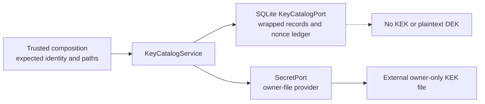

# KEY-001A — durable wrapped-key catalog and restart readiness

Status: `IN_PROGRESS`. This is a bounded precursor inside canonical `KEY-001`; it is not a new
stable capability and does not promote `KEY-001`, `KEY-002`, `DATA-001`, `SPIKE-BACKUP`,
`THR-KEYS-001` or `VFY-KEYS-001`.

## Objective

Persist the native owner-file provider's readiness sentinel, AES-GCM nonce reservations, usage
accounting and independent wrapped synthetic profile keys so a fresh process can authenticate the
same installation and safely resume key access without creating, discovering or repairing KEK
material.

## Delivered design boundary

Trusted composition pins installation, catalog and sentinel IDs; provider kind and instance; KEK
ID/version; schema and usage limit; exact key path; and disallowed managed roots. SQLite is not
allowed to nominate a different identity or provider. The key adapter has no persistence import,
and the catalog never receives raw KEK or plaintext DEK bytes. The stored source commitment is a
domain-separated comparison value, not a KEK, recovery secret or substitute trust anchor;
sentinel authentication still proves possession of the exact external source.

## Durable schema version 1

| Table | Cardinality and purpose | Critical invariants |
| --- | --- | --- |
| `key_catalog` | one installation catalog | singleton; schema 1; positive revision; state is `preparing`, `active` or `recovery_required`; exact immutable identity; domain-separated 32-byte source commitment; bounded usage |
| `key_nonce_reservations` | append-only AES-key-domain ledger | unique reservation; 12-byte nonce; unique domain+nonce, domain+usage sequence and profile/version binding; strict purpose/binding; lifecycle is `reserved`, `committed` or `burned` |
| `key_readiness_sentinel` | one dedicated readiness proof | catalog/sentinel identity; strict format 1, AAD 1, A256GCM and 48-byte ciphertext; one sentinel reservation |
| `wrapped_profile_keys` | one immutable record per profile/key version | complete persisted binding; strict format; unique committed reservation; no plaintext |

The sentinel consumes usage sequence 1. Every prepared profile wrap consumes the next sequence
when Transaction A commits, regardless of whether the final wrapped key is published. A reserved
nonce is never returned to the pool.

## Profile-key execution plan

| Step | Boundary | Required result before continuing |
| --- | --- | --- |
| 1 | service readiness | exact composition identity, active catalog, authenticated sentinel and pinned source |
| 2 | provider prepare | fresh OS-random nonce reserved in live domain; no DEK generated and no AEAD |
| 3 | catalog Transaction A | nonce row and usage counter committed under `BEGIN IMMEDIATE` and revision compare-and-swap |
| 4 | provider complete | preparation consumed first; independent random 32-byte DEK wrapped with canonical AAD; owned buffer scrubbed best-effort |
| 5 | catalog Transaction B | wrapped record inserted and reservation changed to `committed` in one known-successful commit |
| 6 | service return | wrapped record may now be published to its caller |

The preparation is exact-type, redacted, non-copyable, non-serializable, single-use, synchronized,
issuer-bound and PID-bound. A raw fork cannot use it. A correct-process completion attempt consumes
it before readiness, entropy, source or AEAD work, so a later failure cannot retry that operation.

## Startup and administration

### Existing installation

1. Load the strict catalog and compare it with composition-pinned identity.
2. Require `active` and a committed, exact dedicated sentinel.
3. Construct the one explicitly selected native owner-file provider.
4. Authenticate the sentinel and revalidate the source pin.
5. Admit wrapped-key load/create only through `KeyCatalogService`.

This path performs no key-source provisioning, repair or mutation. Missing, unsafe, malformed,
changed or wrong material; sentinel/AAD failure; or identity substitution durably changes an
`active` catalog to `recovery_required` and pauses key work. `preparing` and
`recovery_required` are never silently cleared by routine composition.

### Empty-install ceremony

1. Require an explicit administration entry point and an actually empty catalog.
2. Generate the sentinel nonce using the private OS-entropy call site.
3. Transaction A inserts immutable identity in `preparing`, reserves sentinel usage sequence 1 and
   commits.
4. The narrow owner-file administration adapter validates the pre-provisioned source and creates
   the bound sentinel using the reserved nonce.
5. Transaction B inserts the sentinel, commits its reservation and compare-and-swaps
   `preparing -> active`.
6. Recompose through the ordinary existing-install path and authenticate the persisted sentinel.

The ceremony never creates or modifies the owner-file KEK. It commits a domain-separated
commitment to the source bytes before sentinel AEAD, so an explicit resume cannot bind a replaced
source. An interrupted `preparing` catalog is not automatically completed by routine startup.

After a dirty process death, an explicit initialization reconciliation entry point may read the
strict `preparing` state through a query-only connection, authenticate the originally committed
source, and perform only the exact compare-and-swap that publishes the sentinel. It does not
expose a generic write-capable recovery unit of work and does not clear the outer recovery latch;
a new clean runtime is still required.

## Crash and fault matrix

| Fault point | Durable possibility | Required response |
| --- | --- | --- |
| before preparation | no catalog mutation | fail redacted; safe new attempt after readiness |
| after provider preparation, before Transaction A | nonce used only in memory; no AEAD | no completion; preparation terminal/abandoned |
| Transaction A known rollback | no AEAD occurred | do not complete; a later operation uses a fresh nonce |
| Transaction A commit outcome unknown | reservation may exist | latch recovery; no AEAD, no automatic retry |
| after Transaction A, before/during DEK generation | durable `reserved` nonce | leave it burned; return no key |
| AEAD/backend/source failure | durable `reserved` nonce; completion consumed | leave it burned; return finite redacted failure; no retry |
| after AEAD, before Transaction B | durable `reserved` nonce, wrapped value only in process | return no key; reservation remains burned |
| Transaction B known rollback | no published record | return no key; reservation remains burned |
| Transaction B commit outcome unknown | wrapped record may be durable | latch recovery; never return/retry; require reconciliation |
| after known Transaction B commit | committed reservation and wrapped record | return exact record once |
| crash after return | committed record remains loadable | restart authenticates sentinel and exact record |
| duplicate profile/version | existing record wins | fail `duplicate_profile_key`; never overwrite |
| nonce collision or ledger inconsistency | unsafe AES-key domain | latch recovery; deny wrap and unwrap |
| usage limit reached | no new reservation | fail `usage_limit`; existing valid records remain subject to readiness |

Commit ambiguity is deliberately stronger than a normal database exception. The adapter attempts
to latch `recovery_required`; the SQLite runtime's existing dirty/recovery boundary remains the
outer guard if even that latch cannot be durably established.

## Substitution and corruption tests

The package must fail closed for independent changes to:

- installation, catalog and sentinel identity;
- provider kind/instance, KEK ID/version and usage limit;
- profile ID, profile-key version and catalog-schema version;
- reservation ID, purpose, lifecycle, usage sequence and nonce;
- format version, AAD version, suite, ciphertext or tag;
- catalog state/revision, duplicate singleton rows, missing joins and inconsistent counters;
- owner-file path, ancestor, inode, ownership, mode, link count, bytes or lifetime source pin.

Whole-catalog identity is checked against trusted composition. AES-GCM authenticates the complete
canonical record binding. Errors, `repr`, diagnostics and logs must not disclose paths, nonce,
ciphertext, AAD, bindings, backend exception text, KEK or plaintext DEK.

## Migration and rollback plan

- Upgrade `0002_auth_decision_state -> 0003_key_catalog` under the existing deployment migration
  lock, eligible filesystem check, writer lease and dirty-startup policy.
- Test fresh upgrade, repeated head upgrade, previous-to-head upgrade, head-to-previous downgrade
  and re-upgrade on both locked Python runtimes.
- Verify database constraints directly with malformed rows and concurrency attempts.
- Downgrade drops only the four catalog tables. A canary owner-file's bytes and mode must remain
  unchanged.
- Never present downgrade as recovery. The operator-invoked Alembic downgrade explicitly destroys
  catalog recovery metadata and retains the external key source untouched; no automated warning
  mechanism is implemented in this slice.
- Code rollback removes KEY-001A composition/service/admin adapters and returns to the SPIKE-KEY
  non-durable state; it does not remove or rotate operator material.

## Acceptance plan and evidence

The exact-target evidence table remains provisional until all rows name one immutable commit.

| Gate | Required evidence | Current evidence |
| --- | --- | --- |
| application contracts | preparation ordering, one-use/failure/concurrency/PID behavior, finite errors | exact target `3c43ba7`; application and provider suites in the 174-test integration lane |
| provider | no DEK before reservation point; vector unchanged; nonce/domain/source latches | exact target `3c43ba7`; owner-file runtime/admin suites and crypto review |
| migration/schema | fresh/upgrade/downgrade/idempotence/constraint and key-source canary tests | exact target `3c43ba7`; migration suite and backend review |
| catalog adapter | two commits, burned reservations, duplicate/collision/cap/CAS/corruption/ambiguity | exact target `3c43ba7`; SQLite catalog suite and backend review |
| restart | fresh interpreter initializes, creates two distinct synthetic keys, restarts and unwraps both | exact target `3c43ba7`; fresh-exec and initialization SIGKILL tests |
| concurrency | duplicate creators, second process/writer, nonce collision and usage cap across restart | exact target `3c43ba7`; concurrent-client and durability suites |
| fault injection | every matrix edge, including both commit-unknown paths and sentinel initialization | exact target `3c43ba7`; deterministic ambiguity tests; real profile Tx A/B SIGKILL remains P2 |
| leakage | DB, WAL, SHM, logs, stdout/stderr, exceptions and diagnostics contain no KEK/plain DEK | exact target `3c43ba7`; canary scans and subprocess stream assertions |
| architecture | no persistence in key adapter; no provisioning on runtime port; exact public surfaces | exact target `3c43ba7`; architecture reviewer ACCEPT with zero P0/P1/P2 |
| quality | Ruff, strict source mypy, locked Python 3.12/3.13 full suites | source gates pass; 3.12 focused/broad evidence recorded; dual-runtime Linux CI pending |
| host | named macOS native owner-file restart drill with OS/arch/runtime/filesystem/effective UID | `PLACEHOLDER — exact host evidence` |
| independent review | exact-target security/crypto, backend/infra, edge and OSS verdicts | [review 19](reviews/19-key001a-exact-target-adversarial-review.md): exact `3c43ba7`, all ACCEPT, zero unresolved P0/P1 |

No placeholder is a pass. A code-level accept does not imply host, container, backup, rotation or
stable-product conformance.

Provisional working-tree evidence includes a fresh-exec initialize/open test that compares two
distinct synthetic DEK digests and a real SIGKILL after the initialization reservation commit,
followed by explicit query-only reconciliation while the outer latch remains closed. Profile
Transaction A/B crash edges remain deterministic injected commit-ambiguity tests, not OS-kill
subprocess evidence. These facts do not replace the immutable exact-target evidence rows above.

## Reviewer findings incorporated

1. **P0 — encryption preceded durable nonce accounting:** resolved by prepare, Transaction A,
   consume/AEAD, Transaction B.
2. **P0 — publication could precede durable ownership:** resolved by returning only after known
   Transaction B success.
3. **P0 — commit exception could be treated as rollback:** resolved by explicit
   `commit_outcome_unknown` and recovery latch.
4. **P1 — catalog could authenticate its own substituted identity:** resolved by composition-pinned
   expected identity and exact comparison before provider construction.
5. **P1 — external key/catalog initialization is not atomic:** modeled as durable `preparing`; no
   silent repair, replacement or deletion of either side.
6. **P1 — usage counter could drift from reservations:** strict loading compares normalized rows,
   usage sequence and counter; mismatch latches corruption/recovery.
7. **P1 — duplicate/concurrent profile creation:** unique profile/version, nonce-domain and usage
   constraints plus one SQLite writer and revision compare-and-swap fail closed.

## Strict nonclaims

This package uses synthetic IDs and keys only. It does not store or encrypt real PII, fields,
evidence, blind indexes, event chains or browser/session material. It does not implement profile
creation UX, cryptographic deletion, KEK rotation, DEK rewrap, backup archive inventory, restore,
reconciliation UI, key export/recovery, broker traffic or any external action.

It does not qualify macOS Keychain, container key-only volumes, Linux Secret Service, Docker
Desktop custody, rootless Linux Engine or cloud KMS. It does not prove power-loss durability,
filesystem/mount alias safety, encrypted swap, memory zeroization, protection from same-process
code, debugger/kernel/root/admin compromise, external snapshots/operator copies, FIPS/Secure
Enclave properties, cross-database raw-KEK reuse prevention or independent human cryptographic
certification.

KEY-001A remains `IN_PROGRESS` until every required evidence row is closed on one exact target
with zero unresolved P0/P1. Even then it is only a precursor; canonical `KEY-001` and formal
V0.x-to-V1 promotion require their remaining packages and governance gates.
