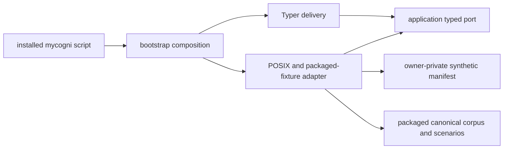

# LOCAL-SYNTH-001 — synthetic local preview

Status: implemented on a development branch; acceptance and release packaging remain open.

## Purpose

`LOCAL-SYNTH-001` gives contributors one installed command for exercising a
bounded local state lifecycle and the reviewed simulator fixtures:

```console
mycogni synthetic init --state-dir /absolute/private/preview --json
mycogni synthetic health --state-dir /absolute/private/preview --json
mycogni synthetic demo --scenario happy --json
```

This is a developer-preview precursor, not `OPS-001`, `UX-002`, `AUTH-001`, or
`KEY-001`. It accepts no identity attributes or real PII. It composes no
network, mail, browser, connector, authentication, key, scheduler, server, or
external-action capability. It does not scan a broker or submit, verify, or
claim a real removal. Source execution does not prove OS-level network
containment.

## Architecture



The application module owns reports, finite reasons, exit codes, and the port.
The entrypoint depends only on that port. Bootstrap is the installed
composition root. The adapter performs descriptor-relative POSIX traversal and
package-resource verification. Import-linter enforces the layer boundaries.

## State contract

The caller must provide an absolute directory. Every existing path component is
opened descriptor-relative with `O_NOFOLLOW`; a symlink component is rejected.
The final directory must be owned by the effective user and exactly mode
`0700`.

The ready inventory contains exactly:

```text
installation.v1.json  mode 0600
```

Initialization temporarily owns:

```text
.initialize.v1
.installation.v1.json.tmp
```

The manifest is canonical JSON identifying
`developer_preview_synthetic_only`, fixture profile
`reserved-domain-simulator-v1`, format version 1, and absent external
capabilities. It contains no identifier, timestamp, host path, credential, key,
or PII.

Initialization creates and fsyncs a marker, verifies the packaged corpus and
scenario digests, writes and fsyncs a temporary manifest, renames it, fsyncs
the directory, verifies the final file, removes the marker, and fsyncs again.
A restart can complete an exact marker-only or marker-plus-temporary state.
Unexpected entries are preserved and rejected; no recursive deletion, chmod
repair, overwrite, or force option exists.

Health is read-only. It opens no SQLite runtime and creates no lock, marker,
database, sidecar, or diagnostic file.

## Output and failures

JSON is canonical, schema-versioned, fixed-order at the report level, and
contains no path, exception text, host metadata, timestamp, or user-supplied
value. Typer parser errors are caught at the installed composition root and
reduced to the same redacted vocabulary.

| Exit | Overall |
| ---: | --- |
| 0 | `initialized`, `already_initialized`, `synthetic_ready` |
| 2 | `usage_error` |
| 20 | `not_initialized` |
| 21 | `initialization_incomplete` |
| 22 | `unsafe_storage` |
| 23 | `state_incompatible` |
| 24 | `state_busy` |
| 26 | `storage_exhausted` |
| 27 | `storage_io_failure` |
| 70 | `internal_error` |
| 130 | `interrupted` |

Health checks explicitly mark authentication, key custody, external actions,
and runtime network containment as not applicable or not proven. Demo output
always reports real PII accepted `false`, live brokers `0`, external actions
unavailable by composition, and real removal outcome `not_applicable`.

## Scenario semantics

The adapter validates the ordered `from_state`/`to_state` chain and bounded
delay type before reporting the final fixture state. The public cases include
happy, not found, ambiguous, CAPTCHA/MFA stops, rate limiting, unknown outcome,
schema drift, partial, denial, and resurfacing. CAPTCHA/MFA is never bypassed;
unknown outcome prohibits retry; rate limiting is respected; resurfacing is
reported as recurrence. A fixture result is always prefixed `simulated_` and
is never product removal evidence.

## Acceptance evidence still required

- full locked Python 3.12 and 3.13 gates on the exact commit;
- installed wheel resource and console-script smoke;
- fault injection at each write/fsync/rename boundary;
- concurrent initializer evidence;
- exact native macOS arm64 and Linux amd64 portability evidence;
- a separate hardened, inspected Docker one-shot profile before any
  network-contained container claim;
- independent backend/security and OSS review with no P0/P1;
- documentation/claim guard and final prerelease version alignment.
