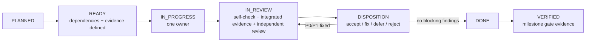

# V1 orchestration and adversarial review

The root orchestrator owns scope, contracts, integration order, release language and the completion matrix. Agents implement bounded work packages; they do not independently broaden product scope, promote connectors or alter evidence semantics.

## Requested model roles and actual attestation

The maintainer requested Luna implementation agents and Sol adversarial reviewers. The available collaboration interface exposes task, context and agent identity but no model-selection or model-attestation field. Therefore:

- `Luna` is used only as an implementation-role label;
- `Sol` is used only as an independent-review-role label;
- no document, commit or release may claim those underlying models ran;
- separation is enforced through independent prompts, bounded context, different review hats and recorded dispositions.

This limitation does not weaken the requirement for qualified human review. Agent reviews are design input, never legal approval, security certification or the second reviewer required by `GOV-01`.

## Maximum-three-worktree layout

| Worktree | Primary lane | Owns | Must not own |
| --- | --- | --- | --- |
| `integration` | product/integration | root docs, web/UI, product experiments, release status, integration and completion matrix | core migrations; connector/egress implementation |
| `core` | core/data/security | domain/application contracts, Alembic migrations, crypto/auth/jobs/evidence/journal | browser/mail transports; release promotion |
| `boundary` | boundary/platform | CI/build, simulator boundary, connector protocol/artifacts, runner, egress, packaging | direct core DB/vault access; policy/product claims |

Three is a hard ceiling, including the integration checkout. Short-lived issue branches may rotate through a lane; do not create a worktree per agent. Contracts merge before dependent adapters. Only the core lane authors migrations. The integration lane owns root lockfiles and resolves cross-lane dependency updates.

Suggested setup after the plan pack lands:

```bash
git worktree add ../MyCogni-core -b lane/core-v1 main
git worktree add ../MyCogni-boundary -b lane/boundary-v1 main
```

Each lane still uses issue-sized branches or commits. Long-lived lanes are integration conveniences, not release branches.

## Agent team

### Orchestrator

- maintains `WORK_PACKAGES.md` readiness and `COMPLETION_MATRIX.md` evidence;
- freezes and versions cross-lane contracts;
- assigns one package per agent turn with explicit dependencies and non-goals;
- integrates the smallest safe slice frequently;
- invokes independent review after self-check and integration tests;
- records accept, reject, defer or mitigate decisions;
- stops work when a P0 boundary is unresolved.

### Luna-labeled implementation roles

- **Principal engineer:** domain/application vertical slices, failure semantics and tests.
- **Principal architect:** interface freeze, dependency rules, ADRs and cross-lane consistency.
- **Principal product manager:** user journey, learning gates, claim language and stop/go evidence.
- **Principal scientist:** measurement validity, matching/verification thresholds, denominators and abstention.
- **Senior OSS contributor:** contributor ergonomics, reproducible builds, issue sizing, release/support sustainability.

An implementation agent may self-review for completeness but cannot satisfy the independent Sol gate for its own change.

### Sol-labeled independent review hats

1. **Security/recovery reviewer:** authentication, crypto, isolation, external-effect races, backup/restore, incident containment.
2. **Product/misuse reviewer:** unsafe defaults, false confidence, disclosure comprehension, accessibility, PMF validity and claims.
3. **Backend/OSS/platform reviewer:** state-machine correctness, migrations, failure recovery, supply chain, resource budget and maintainability.

Reviewers receive the work package, diff, acceptance evidence and relevant ADRs. For P0/boundary changes and milestone candidates, all three independent prompts are launched before any result is used; this is independent-prompt review, not a claim of technically blind isolation. Ordinary low-risk packages need at least one independent reviewer, with additional hats triggered by the risk matrix.

## Work-package lifecycle



Definitions:

- `PLANNED`: described but dependencies/evidence may be incomplete.
- `READY`: dependencies satisfied; risks, rollback and evidence are explicit.
- `IN_PROGRESS`: one owner and one active lane.
- `IN_REVIEW`: self-check and integrated evidence exist; implementation is frozen except review fixes.
- `BLOCKED`: an external decision or failed P0 gate prevents safe progress.
- `DONE`: merged with all P0/P1 review findings resolved or explicitly release-blocking.
- `VERIFIED`: milestone acceptance evidence was reproduced from the integrated branch.

`DONE` is not `VERIFIED`. A green unit suite cannot substitute for restore, failure-injection, comprehension, human-review or recurring-pilot evidence.

## Change packet required for review

Every nontrivial change packet contains:

1. work-package ID and normative requirement/threat references;
2. one-sentence user-visible outcome and explicit non-goals;
3. diff plus migration, compatibility, rollback and deletion consequences;
4. unit/contract/integration/adversarial evidence;
5. synthetic fixture provenance and PII-canary result;
6. security, privacy, accessibility and resource-budget impact;
7. status/claim/support-matrix impact;
8. known residual risks and questions for reviewers.

## Independent review protocol

Each Sol reviewer returns findings with severity, exploit/failure story, affected evidence, required correction and a verification test.

- `P0`: can cause unauthorized disclosure/action, false verification, unrecoverable data/key loss, boundary bypass or materially false release claim. Stop integration and release.
- `P1`: probable security/privacy/reliability/accessibility failure or missing stable gate. Fix before milestone verification.
- `P2`: bounded quality/maintainability issue. Assign owner/milestone; it may not silently disappear.
- `P3`: suggestion with no current correctness impact.

The orchestrator records one disposition per finding:

- `accepted-fixed`, linking commit and test;
- `accepted-blocking`, naming owner and dependency;
- `mitigated`, with control, owner and expiry;
- `deferred`, only outside the claimed milestone and with rationale;
- `rejected`, with evidence showing the failure story does not apply.

P0/P1 fixes return to the original reviewer for re-review. Stable V1 has zero unresolved P0 and no unresolved P1 on an enabled capability. A P1 may be deferred only by disabling/removing the surface from stable artifacts and claims. No author resolves an independent finding by declaration.

## Integration cadence and collision control

- Merge the shared contract before adapters and UI.
- Integrate small vertical slices at least once per completed package; avoid week-long lane divergence.
- Rebase/merge the current integration branch before review evidence is recorded.
- One migration owner and one lockfile owner operate at a time.
- Never combine a broad formatter/dependency sweep with domain behavior.
- Preserve unrelated maintainer changes and use scoped commits.
- Run network-deny, PII-canary, migration and architecture checks on every lane merge.
- Run complete failure-injection and synthetic E2E gates on milestone candidates.

## Live-action restrictions

CI and ordinary agent work never contact a real broker. A bounded consenting controlled-identity canary may run only from a protected integrated candidate after:

- the exact capability is selected and digest-pinned;
- current terms/policy/source/disclosure worksheets exist;
- qualified human policy/legal and connector/security reviewers approve it;
- the global/profile/broker/capability kill switches are tested;
- the maintainer explicitly authorizes the bounded canary;
- evidence and quarantine/rollback procedures are active.

The canary itself may cause an irreversible deletion request; “controlled” means bounded consent, scope, monitoring, quarantine and incident response, not reversibility.

An AI review, elapsed schedule, successful simulator run or connector signature cannot replace these conditions.

## Status reporting

Each orchestration update reports:

- current milestone and packages changed;
- completed evidence, not just code written;
- active blockers and decisions needed from the maintainer;
- P0/P1 review findings and dispositions;
- next two executable packages by dependency order;
- public release status and whether any claim changed.

The completion matrix is authoritative. Chat summaries and commit messages cannot promote a milestone.
