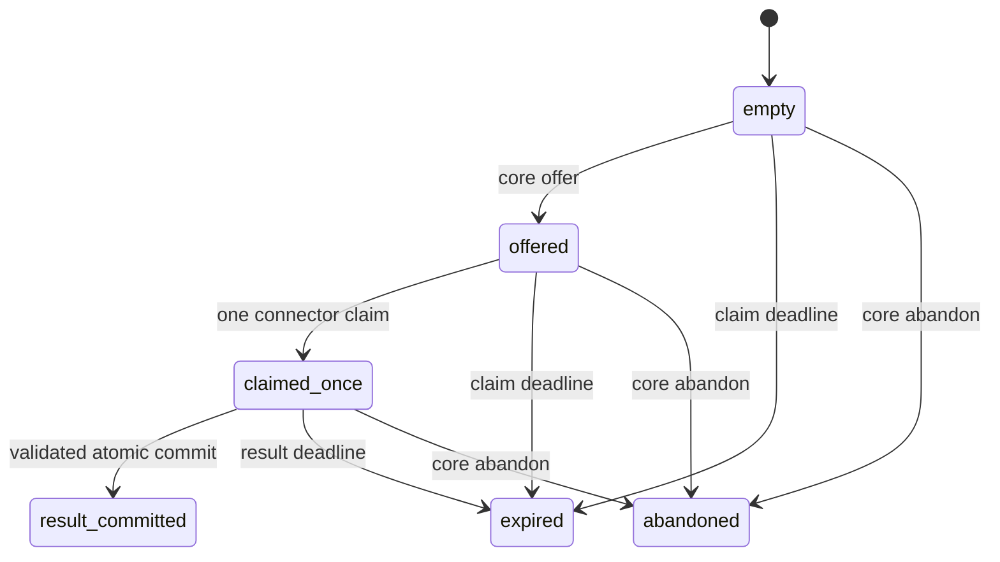
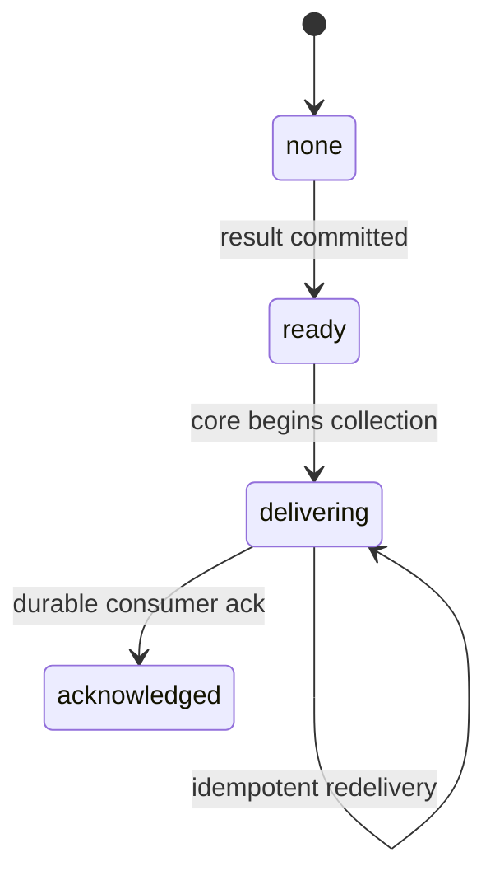

# SPIKE-RUNNER — finite mailbox and protocol decision slice

Status: successor persistent-state and separate synthetic mailbox-artifact
containment evidence is implemented, awaiting independent adversarial re-review. This is not package
acceptance, untrusted-connector OCI isolation evidence, or a runnable connector
service. See ADR-0014 and `RUNNER-PERSISTENCE-OCI-EVIDENCE.md`.

Decision target: determine whether a statically declared connector can receive one
action and return a bounded untrusted attempt fact without a Docker socket, shared
core storage, reusable credential, or replayable mailbox. The pure slice supports
continued evaluation of a small mailbox sidecar. PF-002 must still prove the real
container topology and resource controls.

## Boundary and faces

`services/runner_mailbox/` has a framework-free domain, typed ports, a strict
application service, and a volatile lock-serialized reference repository. There is
no network, filesystem, process launch, trusted-core import, outcome inference, or
broker authorization in this slice.

The connector face contains only:

- one claim operation authenticated by a claim credential; and
- evidence staging and result commit authenticated by the independently generated
  result credential returned by successful claim.

Offer, redacted snapshot, abandon, collect, and collection acknowledgement require
the collection credential held by trusted core. Installation-wide expiry and GC
require a distinct maintenance credential. There is no unauthenticated snapshot,
offer, expiry, or cleanup surface.

The volatile repository cannot be constructed without an explicitly provisioned
maintenance credential digest. It must be exact immutable 32-byte digest material;
there is no generated, unknown default. Provisioning rejects equality with action,
claim, result, or collection roles for every active mailbox before mutation.

## State and collection axes

Mailbox lifecycle and trusted-core delivery are deliberately separate:





`result_committed` is internal mailbox truth, not a broker or removal status. The
credential-scoped snapshot is redacted to mailbox ID, internal axes, byte/count
totals, and retention flags; it does not expose the action binding. External status
rendering is outside this component and must never map these states to an outcome.
Snapshot samples and validates time after acquiring the repository lock, advances
the record high-water, applies due expiry, and reports the observed instant plus
claim/result deadlines. It cannot render an indefinitely stale `offered` state.

Collection is two-phase. `collect` begins or resumes delivery without deleting the
bundle. Only `acknowledge_collection`, called after the trusted consumer durably
records it, clears result and evidence. A crash after ack is idempotently
recoverable; collection after acknowledged state is replay-denied. The volatile
adapter proves transition semantics but not restart durability.

## Immutable binding, deadlines, and four secret roles

Every action binds exact UUIDv4 identifiers, selected artifact digest, connector
release and capability, dispatch/fence/authorization epochs, canonical action
digest, claim deadline, result deadline, wall-budget metadata, and response bytes.

- The earlier claim deadline bounds how long an offer can be accepted.
- The action deadline bounds evidence and result commit after claim.
- `wall_seconds` is metadata for the later runtime enforcer. This slice checks its
  value and equality but does not enforce elapsed CPU or wall time.

The repository samples its clock only after acquiring the transaction lock. A
caller blocked behind another transaction cannot carry a stale service-layer time
sample across the lock. Rollback against the per-record high-water fails before
mutation. Authenticated GC advances both the installation high-water and every
surviving record's high-water in the same locked transaction; a later claim or new
mailbox cannot roll back behind a completed sweep. The persistent successor
stores and authenticates that time high-water and binds its restore epoch;
external monotonic rollback detection and restore/rebind ceremony remain open.

Four per-action secrets are pairwise distinct and at least 256 bits:

1. action key/credential authenticates the core offer and seals action attributes;
2. claim credential consumes the offer once;
3. result credential is generated by the mailbox, delivered once, and burned at
   result commit;
4. collection credential scopes core diagnostics, abandon, collection, and ack.

The repository also rejects a credential already active for another mailbox. The
maintenance credential is installation-scoped and cannot perform connector or
collection operations.

## Capability/result/next-action policy

Strict `ResultEnvelope` schema validation is necessary but not sufficient. The
service applies an exhaustive matrix over every protocol capability, result code,
and next-step enum. Import fails if a newly added enum lacks policy coverage.

- `observe` cannot emit prepared, transport, receipt, acknowledgement, processing,
  or completion facts.
- `prepare` can emit only `payload_prepared` plus challenge, inconclusive, or
  failure facts; it cannot claim any send or broker effect.
- submit, poll, and verify each have an explicit finite result set.
- each result has an explicit next-step set.
- `retry_later` is accepted by the wire schema for compatibility but rejected by
  every mailbox policy cell. A connector cannot decide to retry after possible
  effect or uncertainty. Trusted core must reconcile facts and authorize a fresh
  attempt with a new fence and credentials.

All rejected matrix cells leave state, evidence, and credentials unconsumed.

## Sensitive evidence and byte accounting

Connector evidence is named an **untrusted sensitive payload**, not ciphertext.
The connector's `payload_digest` detects an ingress mismatch but proves neither
origin nor encryption. It is recomputed, placed inside the authenticated encrypted
frame, and never retained as an unkeyed digest of predictable plaintext. The
storage adapter immediately wraps bytes under a mailbox-owned key before retention,
then authenticates and unwraps only for core collection.

The full canonical result envelope is subject to the same rule. Retained metadata
contains only bounded byte count, nonce, a SHA-256 corruption hash over randomized
ciphertext, a keyed HMAC over safe associated data plus the encrypted-frame
semantics, and the authenticated wrapped body. The HMAC prevents offline dictionary
matching of low-entropy names or addresses without the storage key; the unkeyed
hash never covers plaintext. The volatile adapter demonstrates this contract with
AES-256-GCM and binding/metadata-associated data. Its process-local key is
intentionally not a production key-management design.

Evidence identity is bound three ways: the repository dictionary slot and wrapped
object ID must be exactly equal, both values are present in AEAD associated data,
and the object ID is repeated inside the encrypted frame covered by the semantic
MAC. Every stage, subsequent stage, commit, scoped snapshot, collect, and ack
authenticates this slot binding. Moving an item to an alias key, swapping two
wrapped objects, or referencing an alias is an integrity failure before result or
delivery state changes. Result frames analogously include a digest of the complete
immutable `ActionBinding` in both associated data and the encrypted frame, so a
wrapped result cannot move to another mailbox or produce a bundle with any
substituted binding field.

Commit also creates a keyed, authenticated evidence manifest over the sorted exact
object IDs, exact count, complete action binding, and wrapped-result digest. Scoped
snapshot, collect, and acknowledgement reparse the authenticated result references
and require their IDs and evidence metadata to match both the current authenticated
slots and that committed manifest. Missing, extra, moved, or swapped evidence and
manifest/result substitution fail closed before delivery or erasure. Every record
operation and authenticated maintenance sweep performs the complete retained-material
check before reading a new clock observation, advancing a high-water mark, expiring
or clearing payloads, changing state, or changing quota counters.

Raw payload bodies are absent from repr, snapshots, and finite error text. Tests use
PII canaries to prove the volatile record retains authenticated wrapped bytes rather
than raw connector payload. Persistent adapters must additionally prove raw values
never enter database diagnostics, logs, traces, crash output, backups, or temporary
files.

Per mailbox, result-envelope bytes plus staged evidence bytes must be less than or
equal to the exact action response budget. Evidence also has item and protocol
aggregate bounds. Installation limits independently bound active records, total
offered envelope/key/credential material, total evidence bytes, and total committed
response bytes; capacity exhaustion returns finite backpressure without mutation.
Small-host defaults are 64 records, 16 MiB active claim material, 64 MiB staged
evidence, and 64 MiB committed responses. Claims/expiry/abandonment release active
material quota in the same transaction.

## Retention, GC, and replay

Authenticated GC never deletes a committed bundle that lacks durable consumer ack,
even after months idle. It remains visibly `ready` or `delivering` for reconciliation
and idempotent redelivery; bounded installation quotas apply backpressure instead
of inventing a retry or silently losing possible-effect evidence. A future privacy
horizon may destroy such data only after trusted core durably records and
acknowledges a typed loss/reconciliation fact. This spike intentionally does not
invent that authority.

Acknowledged/expired/abandoned records have a finite terminal retention window.
GC removes eligible terminal records, releases quota counters, and creates finite
tombstones. Tombstones reject mailbox-ID replay for their full configured horizon.
When tombstone capacity is full, additional terminal records remain in the record
table as replay barriers until a tombstone slot expires; no tombstone is evicted
early. After the configured horizon, unpredictable UUIDv4 IDs, fresh credentials,
dispatch epochs, fences, and a durable restore epoch must provide the remaining
defense in a production adapter.

Concurrency tests cover single claim/commit winners and installation evidence
saturation. Crash edges cover claim, evidence, result commit, and collection ack.
Tests cover months-idle redelivery, GC/claim clock races, and tombstone-capacity
overflow without shortening replay retention.

## Nonclaims and remaining runtime work

- `VolatileMailboxRepository` loses all state and its wrapping key on restart. It
  must never carry a real action. `PersistentMailboxRepository` is its SQLite
  successor; it atomically reopens unacknowledged delivery state but remains
  synthetic-only until the separate connector/gateway packages are accepted.
- AES-GCM here proves the adapter contract only. Production requires durable
  envelope-key management, rotation, restore-epoch invalidation, backup policy,
  backup/restore rebind, external rollback detection and host power-loss qualification.
- An explicit storage key is accepted only when it is exact immutable 32-byte
  material. Only explicit `None` generates an ephemeral key; falsey or malformed
  values fail instead of silently replacing operator input.
- Python bytes, allocator copies, swap, crash dumps, and host memory are not
  guaranteed zeroized.
- SHA-256 credential digests assume uniformly random credentials; they are not a
  password KDF.
- No signature, release SBOM/provenance, published-manifest freshness,
  revocation, authorization or registry lookup is verified here. Two separate
  no-cache native-arm64 builds with fixed source epoch/labels and explicit
  attestation exclusion reproduce one exact local image ID; archive tag/index
  bytes and multi-architecture release artifacts remain nonclaims.
- A separate synthetic mailbox-artifact Compose smoke has local Docker evidence for read-only root,
  default seccomp, dropped capabilities, no-new-privileges, private IPC/cgroup
  namespaces, PID/CPU/RAM caps, network none, socket absence and bounded tmpfs.
  Runtime distribution/export inventory proves it contains no trusted-core package
  and exact invocation-owned smoke cleanup is verified. It is not an untrusted
  connector artifact, direct-egress test, action-scoped credential topology,
  wall-time watchdog or malicious-connector cleanup proof.
- NET-001 remains a source/runtime safety belt, not kernel containment.
- A valid connector result remains an untrusted attempt fact, never proof of
  transport, acknowledgement, compliance, absence, or removal.

Connector OCI acceptance must separately record effective multi-architecture
artifact evidence, malicious containment probes, storage/log cleanup,
restart/orphan recovery, action-scoped credentials, fenced egress and resource
termination. ADR-0014 accepts only the synthetic mailbox successor boundary.

## Verification

Run the locked toolchain on both supported Python versions:

```text
uv run --all-packages --frozen --python 3.12.12 ruff check .
uv run --all-packages --frozen --python 3.12.12 mypy -p services.runner_mailbox -p mycogni_runner_mailbox_runtime
uv run --all-packages --frozen --python 3.12.12 python scripts/ci/guarded_pytest.py tests/runner_mailbox tests/architecture/test_runner_containment.py packages/mycogni-connector-sdk/tests tests/ci/test_safety_guard.py
uv run --all-packages --frozen --python 3.13.11 ruff check .
uv run --all-packages --frozen --python 3.13.11 mypy -p services.runner_mailbox -p mycogni_runner_mailbox_runtime
uv run --all-packages --frozen --python 3.13.11 python scripts/ci/guarded_pytest.py tests/runner_mailbox tests/architecture/test_runner_containment.py packages/mycogni-connector-sdk/tests tests/ci/test_safety_guard.py
```

Exact counts and full-repository results belong in the independent review for the
reviewed commit. Passing focused tests does not complete PF-002 or accept V1.

## Rollback

Revert only the successor additions: ADR-0014/index row, `persistent.py` and its
export, `CONTENDED`, persistent/OCI-focused tests, runtime anchor and lock entry,
runner Dockerfile/bake target, Compose profile, both containment validators,
evidence/roadmap/site changes and `.dockerignore`/container-skeleton additions.
Preserve the pre-existing domain/service/volatile runner slice, its tests and
review 13. Remove only the project-scoped smoke container/volume and local runner
image; preserve negative review evidence and never reuse synthetic credentials.
