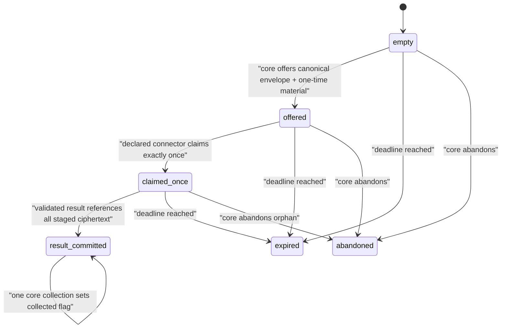

# SPIKE-RUNNER — pure mailbox/protocol decision slice

Status: implementation evidence awaiting independent adversarial review. This is
not package acceptance, an OCI isolation result, or a runnable connector service.

Decision target: determine whether a statically declared connector can receive one
action and return bounded ciphertext without a Docker socket, shared core storage,
reusable credential, or replayable mailbox. The pure slice provisionally supports a
sidecar protocol. It does not create or accept an ADR: independent review and real
runtime evidence can still reject the topology. Real runtime disposition remains
blocked until PF-002 can produce real-engine evidence.

## Proposed decision disposition

Provisionally prefer a tiny predeclared trusted mailbox sidecar over placing a
connector-facing endpoint inside the trusted core. The sidecar would expose only an
action-scoped claim/result face to the connector and a separate offer/collect face
to the core. This keeps the large, high-value core process off the untrusted
connector network and avoids shared filesystem paths, host volumes, dynamic launch,
or a Docker socket.

This remains a proposal rather than governance truth. A persistent adapter must
resolve authenticated storage, atomic collection acknowledgement, restart recovery,
restore-epoch invalidation, orphan sweeping, and a durable time high-water. PF-002
must then prove the effective engine topology and cleanup on each claimed platform.
If those controls cannot be demonstrated, the spike records a blocker and the
sidecar proposal is rejected or replaced before an ADR is accepted.

## Implemented scope

`services/runner_mailbox/` contains three separable layers:

| Layer | Responsibility | Deliberately absent |
| --- | --- | --- |
| `domain.py` | immutable binding, finite states/reasons, secret-redacted transfer types | framework, network, filesystem, core imports |
| `ports.py` | injected clock, credential digest, failure hook, atomic repository protocol | concrete runtime or persistence |
| `service.py` | strict `ActionEnvelope`/`ResultEnvelope` parsing, binding and evidence checks | authorization, artifact trust, outcome inference |
| `volatile.py` | lock-serialized one-process reference adapter and crash edges | durability, host isolation, secure memory claim |

The service imports the standalone `connector_protocol`; that package imports
neither the sidecar nor `mycogni`. The trusted core is not imported and the sidecar
has no path to core data.

## Finite protocol



No replay path returns to `offered`. A crash after atomic claim consumes the key and
leaves an orphaned `claimed_once` mailbox for explicit core abandonment. A crash
after atomic result commit leaves `result_committed`, so the core can collect it.
Expiry, crash, and abandonment do not create protocol results or external outcome
facts.

## Immutable binding and role separation

Every operation presents the same `ActionBinding`. It contains:

- UUIDv4 mailbox/action/intent/attempt IDs;
- selected `sha256` artifact digest supplied independently of manifest parsing;
- canonical bounded connector release and capability;
- non-negative installation dispatch epoch, fence, and authorization epoch;
- exact aware-UTC deadline and positive bounded wall/response budgets;
- digest of canonical strict protocol-v1 action JSON.

Zero is a valid initial epoch/fence. Python booleans are rejected even though `bool`
is an `int` subclass. Wrong digest, release, capability, action, attempt, epoch,
fence, deadline, or budget fails before claim/upload/commit state mutation.
The injected UTC clock advances a per-mailbox high-water; rollback fails closed and
cannot extend the deadline. Persistence of that high-water is not proven.

Credentials are role-distinct and at least 256 bits:

1. claim credential: consumes envelope and action key once;
2. result credential: generated inside the sidecar from an injected operating-system
   randomness port and returned only by a successful claim; it permits bounded
   evidence staging, then is burned by one result commit;
3. collection credential: retained by the core for abandon or one result collection.

The application requires claim and collection credentials to differ. Offer also
rejects a generated result credential equal to either role or the action key.

## Result and evidence semantics

Evidence is non-empty opaque ciphertext with canonical kind, UUIDv4 object ID,
SHA-256 digest, at most 64 objects, and the smaller of the action response budget or
protocol aggregate byte bound. Upload recomputes the digest and prevents object
overwrite. Commit parses strict protocol-v1 result JSON and requires:

- exact action and attempt IDs;
- every result evidence reference has an uploaded object;
- no staged object is omitted;
- exact object ID, kind, digest, and byte count equality;
- protocol result/reason vocabulary and aggregate limits remain valid.

The deterministic test fixture uses only reserved-domain synthetic identifiers and
records `candidate_observed`. The mailbox does not interpret that fact and never
upgrades it to acknowledgement, broker assertion, one-absence observation, or
`verified_removed`.

## Failure evidence

| Required failure | Executable evidence |
| --- | --- |
| wrong artifact/release/capability/fence/epochs/deadline/budgets/action digest | `test_every_immutable_binding_dimension_is_checked_on_claim` |
| claim replay, cross-mailbox access and wrong role credential | state-machine and result/evidence denial tests |
| concurrent double claim | 64 contenders produce exactly one claimed action |
| oversized/invalid envelopes and strict result schema | protocol parsing bounds plus connector-protocol suite |
| evidence digest/size/reference mismatch and overwrite | result/evidence adversarial tests |
| crash before/after claim, upload and result commit | six named deterministic failure-injection edges |
| orphan cleanup and action/result key logical disposal | abandon/expiry and post-claim redacted snapshots |
| clock rollback extends deadline | last-seen high-water denial test |
| PII/key canaries in repr/errors/snapshots | boundary redaction tests and repository safety guard |
| connector/core import separation | AST boundary test and standalone SDK distribution tests |
| network/process path absent | AST boundary test plus NET-001 source and runtime guards |

These are candidate review targets for `VFY-RUNNER-001`; this slice does not change
the governed threat/test catalog or claim authenticated acceptance.

## Operator and security nonclaims

- `VolatileMailboxRepository` is erased on process restart; restart durability is
  unproven and it must never carry a real action.
- Mutable internal buffers are overwritten and references dropped on
  claim/expiry/abandon. Returned immutable Python bytes, allocator copies, swap,
  crash dumps, and host memory are not guaranteed zeroized.
- SHA-256 is used only to compare independently generated high-entropy one-action
  credentials. This is not a password KDF or encryption scheme.
- No signature, SBOM, provenance, manifest freshness, revocation, authorization,
  image lookup, or runtime digest is verified here. The selected artifact digest is
  an immutable caller-supplied binding, not proof that a container matches it.
- No Compose, OCI image, sidecar transport, host path, environment allowlist,
  namespace, seccomp, capability, PID/CPU/RAM/time enforcement, or cleanup of real
  volumes/layers/logs has been exercised.
- No network exists in the slice. NET-001 remains a pytest safety belt, not runtime
  containment. Egress and first-byte authorization belong to later packages.
- Collection is an atomic in-process move, not durable delivery acknowledgement.
  Persistent collection/ack crash semantics must be resolved before implementation.
- A valid connector result is an untrusted attempt fact, never proof of transport,
  acknowledgement, compliance, or removal.

## Runtime evidence still required

SPIKE-RUNNER cannot be accepted until a responsive real engine records, on each
claimed platform/architecture:

- immutable selected image digest and effective statically declared Compose model;
- non-root/rootless, read-only root, tmpfs, dropped capabilities,
  `no-new-privileges`, syscall and PID/CPU/RAM/time enforcement;
- no Docker socket, host paths, core/data/key mounts, ports/devices/privileged mode,
  host PID/IPC/network/host-gateway, default network, or reusable environment secret;
- malicious probes for environment, `/proc`, metadata/private/loopback/DNS routes,
  other actions, writes outside tmpfs, privilege escalation, and resource kills;
- artifact inspection proving connector contains `connector_protocol` but not
  `mycogni`, while core artifacts contain no connector implementation;
- restart/orphan cleanup proving no envelope/key/evidence survives in volume, image
  layer, log, or unintended host path.

Docker unavailability is a named evidence blocker, not a reason to simulate or
claim these controls.

## Verification commands

Run through the repository's locked toolchain and guarded pytest launcher:

```text
uv run --all-packages --frozen --python 3.12.12 mypy -p services.runner_mailbox
uv run --all-packages --frozen --python 3.12.12 python scripts/ci/guarded_pytest.py tests/runner_mailbox tests/ci/test_safety_guard.py
uv run --all-packages --frozen --python 3.13.11 mypy -p services.runner_mailbox
uv run --all-packages --frozen --python 3.13.11 python scripts/ci/guarded_pytest.py tests/runner_mailbox tests/ci/test_safety_guard.py
```

Focused counts and full-repository gate results are evidence for the exact commit
under review and must be recorded in the independent review, not treated as a
floating acceptance claim here.

## Rollback

Remove `services/runner_mailbox/`, its focused tests, and this spike note; remove
`services/` from the static runtime guard roots and type-check target. Because
the adapter is volatile and synthetic-only, there is no migration or retained real
state. Preserve negative review evidence and do not reuse any synthetic credentials.

## Independent review targets

1. Security/recovery: secret roles, replay/oracle behavior, deadline/restore epoch,
   cleanup, collection acknowledgement, and zeroization nonclaims.
2. Backend/concurrency: atomicity, linearizability, crash edges, bounded memory,
   persistent-adapter contract, and aliasing.
3. Platform/edge: sidecar versus core endpoint, real Compose topology, effective
   mounts/environment/network/namespaces/resources, and cross-platform limitations.
4. OSS/API: standalone package direction, finite compatibility/versioning,
   contributor diagnostics, test readability, and rollback.
