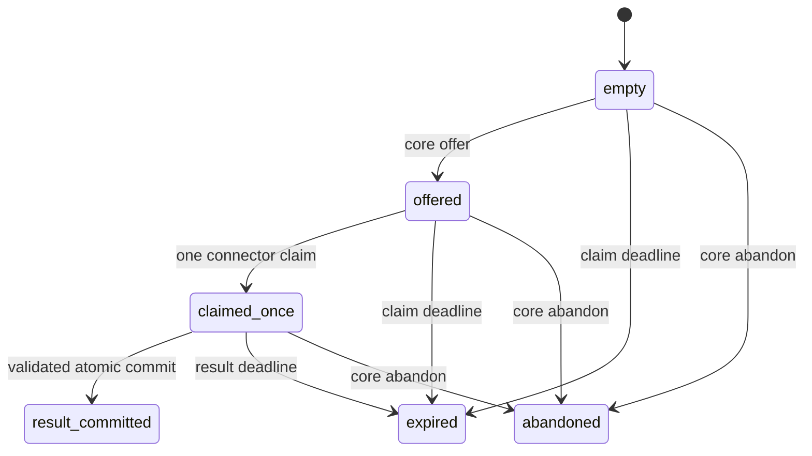
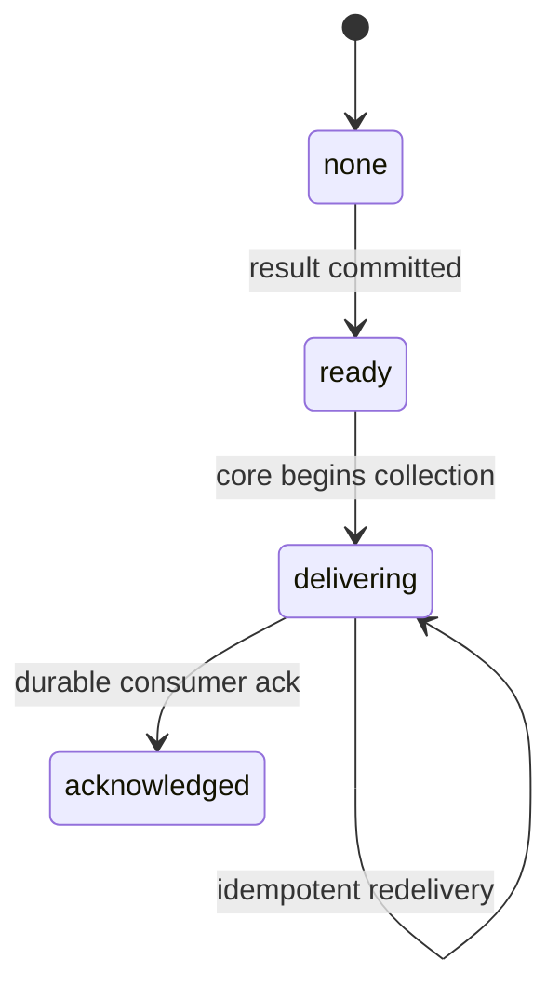

# SPIKE-RUNNER — finite mailbox and protocol decision slice

Status: remediated implementation evidence awaiting independent adversarial
re-review. This is not package acceptance, OCI isolation evidence, or a runnable
connector service.

Decision target: determine whether a statically declared connector can receive one
action and return a bounded untrusted attempt fact without a Docker socket, shared
core storage, reusable credential, or replayable mailbox. The pure slice supports
continued evaluation of a small mailbox sidecar. PF-002 must still prove the real
container topology and resource controls.

## Boundary and faces

`services/runner_mailbox/` has a framework-free domain, typed ports, a strict
application service, and a volatile lock-serialized reference repository. There is
no network, filesystem, process launch, trusted-core import, outcome inference, or
broker authorization in this slice.

The connector face contains only:

- one claim operation authenticated by a claim credential; and
- evidence staging and result commit authenticated by the independently generated
  result credential returned by successful claim.

Offer, redacted snapshot, abandon, collect, and collection acknowledgement require
the collection credential held by trusted core. Installation-wide expiry and GC
require a distinct maintenance credential. There is no unauthenticated snapshot,
offer, expiry, or cleanup surface.

## State and collection axes

Mailbox lifecycle and trusted-core delivery are deliberately separate:





`result_committed` is internal mailbox truth, not a broker or removal status. The
credential-scoped snapshot is redacted to mailbox ID, internal axes, byte/count
totals, and retention flags; it does not expose the action binding. External status
rendering is outside this component and must never map these states to an outcome.

Collection is two-phase. `collect` begins or resumes delivery without deleting the
bundle. Only `acknowledge_collection`, called after the trusted consumer durably
records it, clears result and evidence. A crash after ack is idempotently
recoverable; collection after acknowledged state is replay-denied. The volatile
adapter proves transition semantics but not restart durability.

## Immutable binding, deadlines, and four secret roles

Every action binds exact UUIDv4 identifiers, selected artifact digest, connector
release and capability, dispatch/fence/authorization epochs, canonical action
digest, claim deadline, result deadline, wall-budget metadata, and response bytes.

- The earlier claim deadline bounds how long an offer can be accepted.
- The action deadline bounds evidence and result commit after claim.
- `wall_seconds` is metadata for the later runtime enforcer. This slice checks its
  value and equality but does not enforce elapsed CPU or wall time.

The repository samples its clock only after acquiring the transaction lock. A
caller blocked behind another transaction cannot carry a stale service-layer time
sample across the lock. Rollback against the per-record high-water fails before
mutation. Durable time high-water and restore-epoch handling remain persistent
adapter requirements.

Four per-action secrets are pairwise distinct and at least 256 bits:

1. action key/credential authenticates the core offer and seals action attributes;
2. claim credential consumes the offer once;
3. result credential is generated by the mailbox, delivered once, and burned at
   result commit;
4. collection credential scopes core diagnostics, abandon, collection, and ack.

The repository also rejects a credential already active for another mailbox. The
maintenance credential is installation-scoped and cannot perform connector or
collection operations.

## Capability/result/next-action policy

Strict `ResultEnvelope` schema validation is necessary but not sufficient. The
service applies an exhaustive matrix over every protocol capability, result code,
and next-step enum. Import fails if a newly added enum lacks policy coverage.

- `observe` cannot emit prepared, transport, receipt, acknowledgement, processing,
  or completion facts.
- `prepare` can emit only `payload_prepared` plus challenge, inconclusive, or
  failure facts; it cannot claim any send or broker effect.
- submit, poll, and verify each have an explicit finite result set.
- each result has an explicit next-step set.
- `retry_later` is accepted by the wire schema for compatibility but rejected by
  every mailbox policy cell. A connector cannot decide to retry after possible
  effect or uncertainty. Trusted core must reconcile facts and authorize a fresh
  attempt with a new fence and credentials.

All rejected matrix cells leave state, evidence, and credentials unconsumed.

## Sensitive evidence and byte accounting

Connector evidence is named an **untrusted sensitive payload**, not ciphertext.
`payload_digest` detects mismatch but proves neither origin nor encryption. The
storage adapter must immediately wrap and authenticate bytes under a mailbox-owned
storage key before retention, then authenticate and unwrap only for core
collection. The volatile adapter demonstrates this contract with AES-256-GCM and
metadata-bound associated data. Its process-local key is intentionally not a
production key-management design.

Raw payload bodies are absent from repr, snapshots, and finite error text. Tests use
PII canaries to prove the volatile record retains authenticated wrapped bytes rather
than raw connector payload. Persistent adapters must additionally prove raw values
never enter database diagnostics, logs, traces, crash output, backups, or temporary
files.

Per mailbox, result-envelope bytes plus staged evidence bytes must be less than or
equal to the exact action response budget. Evidence also has item and protocol
aggregate bounds. Installation limits independently bound active records, total
evidence bytes, and total committed response bytes; capacity exhaustion returns
finite backpressure without mutation.

## Retention, GC, and replay

Committed but unacknowledged bundles and acknowledged/expired/abandoned records
have separate finite retention windows. Authenticated GC removes eligible records,
releases quota counters, and creates finite tombstones. Tombstones reject mailbox
ID replay for their configured retention window and are themselves TTL- and
count-bounded. This intentionally chooses bounded replay memory; after tombstone
expiry, unpredictable UUIDv4 IDs, fresh credentials, dispatch epochs, fences, and a
durable restore epoch must provide the remaining defense in a production adapter.

Concurrency tests cover single claim/commit winners and installation evidence
saturation. Crash edges cover claim, evidence, result commit, and collection ack.
Long-idle uncollected bundles are collected by policy rather than retained without
bound.

## Nonclaims and remaining runtime work

- `VolatileMailboxRepository` loses all state and its wrapping key on restart. It
  must never carry a real action.
- AES-GCM here proves the adapter contract only. Production requires durable
  envelope-key management, rotation, restore-epoch invalidation, backup policy,
  and restart/crash recovery.
- Python bytes, allocator copies, swap, crash dumps, and host memory are not
  guaranteed zeroized.
- SHA-256 credential digests assume uniformly random credentials; they are not a
  password KDF.
- No signature, SBOM, provenance, manifest freshness, revocation, authorization,
  image lookup, or runtime digest is verified here.
- No Compose/OCI topology, read-only filesystem, namespace, seccomp, dropped
  capability, PID/CPU/RAM/wall enforcement, network containment, or real cleanup
  has been exercised by this slice.
- NET-001 remains a source/runtime safety belt, not kernel containment.
- A valid connector result remains an untrusted attempt fact, never proof of
  transport, acknowledgement, compliance, absence, or removal.

PF-002 must record effective multi-architecture image and runtime evidence,
malicious containment probes, storage/log cleanup, restart/orphan recovery, and
resource termination. Failure to prove those controls rejects the sidecar proposal
before an ADR can be accepted.

## Verification

Run the locked toolchain on both supported Python versions:

```text
uv run --all-packages --frozen --python 3.12.12 ruff check .
uv run --all-packages --frozen --python 3.12.12 mypy -p services.runner_mailbox
uv run --all-packages --frozen --python 3.12.12 python scripts/ci/guarded_pytest.py tests/runner_mailbox packages/mycogni-connector-sdk/tests tests/ci/test_safety_guard.py
uv run --all-packages --frozen --python 3.13.11 ruff check .
uv run --all-packages --frozen --python 3.13.11 mypy -p services.runner_mailbox
uv run --all-packages --frozen --python 3.13.11 python scripts/ci/guarded_pytest.py tests/runner_mailbox packages/mycogni-connector-sdk/tests tests/ci/test_safety_guard.py
```

Exact counts and full-repository results belong in the independent review for the
reviewed commit. Passing focused tests does not complete PF-002 or accept V1.

## Rollback

Remove `services/runner_mailbox/`, its focused tests, and this spike note; revert
the connector-protocol evidence-field rename and regenerated schema snapshot; then
remove the service from static guards/type-check targets. Preserve negative review
evidence and never reuse synthetic credentials.
